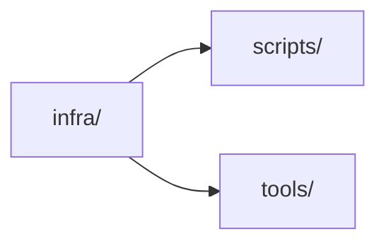

# infra/

## Component Map

## Location

- infra/

## Domain

- [Infra Domain](../domain-infra.md)

## Main Responsibilities

- Infrastructure setup and provisioning
- Root: InfraAggregate (central infra model)
- Aggregates: ScriptAggregate, ToolAggregate
- Ensures environment provisioning, CI/CD support

## Explanation

infra/ is responsible for infrastructure setup and provisioning:

- **Root:** [InfraAggregate](infra.md#infraaggregate) — represents the central infra model, owning environment provisioning.
- **Aggregates:** [ScriptAggregate](infra.md#scriptaggregate), [ToolAggregate](infra.md#toolaggregate).
- **Responsibilities:**
  - Provision environment for DVT system.
  - Support CI/CD and tooling.
  - Report infra status to infra domain.

**Interactions:**

- **[Scripts](scripts.md):** Provides scripts for CI/CD and validation.
- **[Tools](tools.md):** Provides tooling for development and operations.

Infra coordinates these interactions to ensure environment provisioning and CI/CD support.

## InfraAggregate

Represents the central infra model, owning environment provisioning. Responsible for:

- Managing environment setup
- Managing CI/CD support
- Reporting infra status

## ScriptAggregate

Represents script management for infra. Responsible for:

- Storing scripts
- Managing script operations
- Reporting script status

## ToolAggregate

Represents tool management for infra. Responsible for:

- Storing tools
- Managing tool operations
- Reporting tool status

## Restrictions

- Must comply with infrastructure standards and CI/CD requirements
- Only interacts with Infra domain, scripts, and tools

## Related Documentation

- [Component Map](../component-map.md)
- [Infra Domain](../domain-infra.md)

## Detailed Documentation

- [DDD Structure](infra-ddd.md)
- [Functionalities](infra-functional.md)
- [Constraints & Invariants](infra-constraints.md)
- [Sequence Diagrams](infra-sequence.md)
