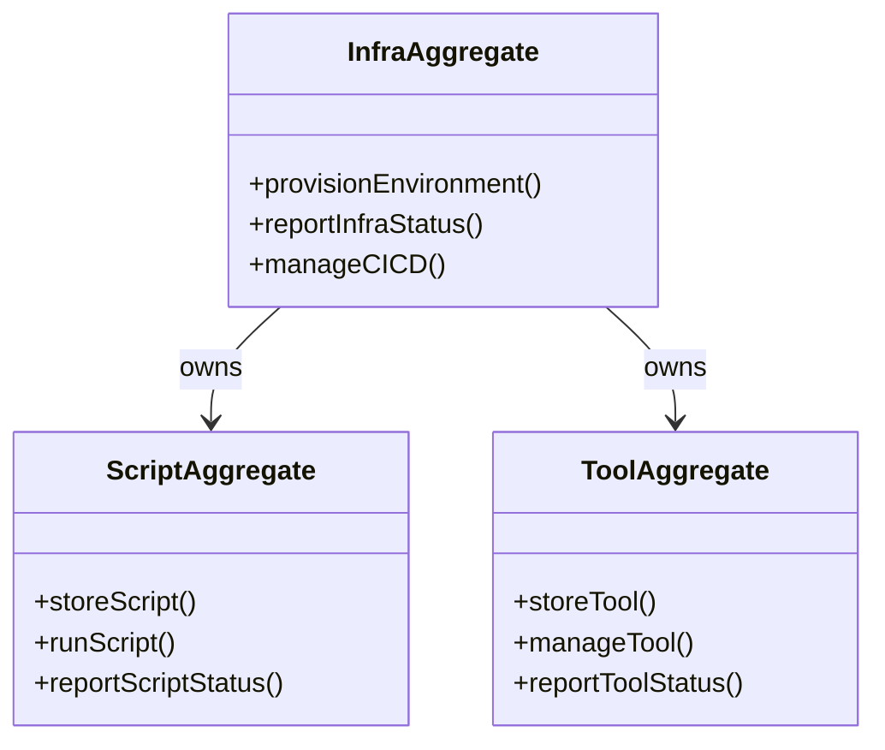

# infra DDD Structure

## DDD Diagram

## Aggregates & Entities

- **InfraAggregate**: Central infra model owning environment provisioning, CI/CD support, and infra status reporting.
- **ScriptAggregate**: Manages storage and execution of CI/CD and validation scripts used by the infra.
- **ToolAggregate**: Manages development and operations tooling, including storage and reporting of tool status.

## Domain Events

- `EnvironmentProvisioned`: Emitted when the environment has been successfully set up and is ready.
- `ScriptExecuted`: Emitted when a CI/CD or validation script completes execution.
- `ToolRegistered`: Emitted when a new tool is registered in the infra aggregate.
- `InfraStatusReported`: Emitted when the infra aggregate reports its current status to the Infra Domain.

## Key Files

- `infra/scripts/` — CI/CD and validation scripts managed by ScriptAggregate
- `infra/tools/` — Development and operations tools managed by ToolAggregate
