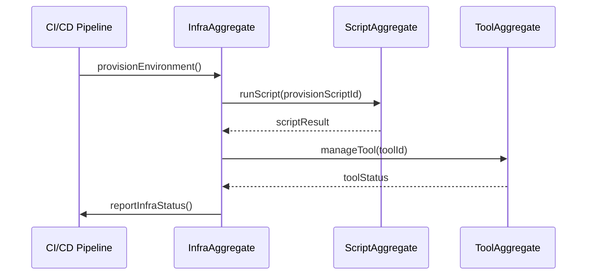

# infra Sequence

## Main Flow: Environment Provisioning

## Global Flow Position

The `infra/` component sits at the foundation of the DVT system. It is invoked by CI/CD pipelines and developer tooling to provision the environment before any other DVT component can operate. It calls into `scripts/` to execute provisioning and validation scripts, and into `tools/` to register and manage development and operations tooling. No other domain component depends on `infra/` at runtime — it provides the environment that all other packages (engine, planner, delivery, etc.) rely on at startup or deploy time.

## Key Files

- `infra/scripts/` — CI/CD and validation scripts
- `infra/tools/` — Development and operations tools
