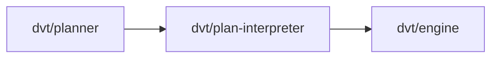

# @dvt/plan-interpreter

## Component Map

## Location

- packages/@dvt/planner

## Domain

- [Planning Domain](../domain-planning.md)

## Main Responsibilities

- Plan compilation and interpretation
- Root: InterpreterAggregate (central interpretation model)
- Aggregates: ArtifactAggregate
- Ensures plan is executable, produces artifacts

## Explanation

@dvt/plan-interpreter is responsible for compiling and interpreting plans:

- **Root:** [InterpreterAggregate](interpreter.md#interpreteraggregate) — represents the central interpretation model, owning all execution artifacts.
- **Aggregates:** [ArtifactAggregate](interpreter.md#artifactaggregate).
- **Responsibilities:**
  - Compile plans into executable artifacts.
  - Interpret plan logic for engine.
  - Return artifacts to engine for execution.

**Interactions:**

- **[Planner](planner.md):** Receives plans for compilation.
- **[Engine](engine.md):** Executes interpreted artifacts.

Interpreter coordinates these interactions to ensure plans are executable and ready for workflow orchestration.

## InterpreterAggregate

Represents the central interpretation model, owning all execution artifacts. Responsible for:

- Managing interpretation state
- Producing artifacts for execution
- Returning artifacts to engine

**Interpretation schema:** See [InterpreterAggregate types](../../packages/@dvt/planner/src/domain/types.ts)
**Interpretation contract:** See [PlannerContracts.v2.3.1.md](../../packages/@dvt/planner/docs/contracts/PlannerContracts.v2.3.1.md)

## ArtifactAggregate

Represents execution artifacts produced by interpretation. Responsible for:

- Storing compiled artifacts
- Associating artifacts with plan steps
- Reporting artifact status

**Artifact schema:** See [ArtifactAggregate types](../../packages/@dvt/planner/src/domain/types.ts)

## Restrictions

- Must comply with contract definitions in [PlannerContracts.v2.3.1.md](../../packages/@dvt/planner/docs/contracts/PlannerContracts.v2.3.1.md)
- Only interacts with Planning and Execution domain components

## Related Documentation

- [Component Map](../component-map.md)
- [Planning Domain](../domain-planning.md)
- [Planner Contracts](../../packages/@dvt/planner/docs/contracts/PlannerContracts.v2.3.1.md)
