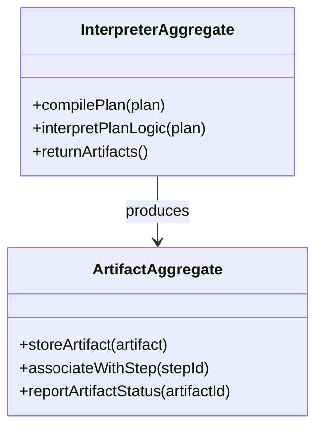

# interpreter DDD Structure

## DDD Diagram

## Aggregates & Entities

- **InterpreterAggregate**: Central interpretation model that owns all execution artifacts. Responsible for compiling plans into executable artifacts and interpreting plan logic for the engine.
- **ArtifactAggregate**: Represents the compiled execution artifacts produced by interpretation. Stores artifacts and associates them with the corresponding plan steps.

## Domain Events

- `PlanCompiled`: Emitted when a plan has been successfully compiled into executable artifacts by the InterpreterAggregate.
- `ArtifactProduced`: Emitted when the ArtifactAggregate stores a new compiled artifact associated with a plan step.
- `InterpretationFailed`: Emitted when plan logic cannot be interpreted due to invalid structure or missing dependencies.

## Key Files

- `packages/@dvt/planner/src/domain/types.ts` — InterpreterAggregate and ArtifactAggregate type definitions
- `packages/@dvt/planner/docs/contracts/PlannerContracts.v2.3.1.md` — Formal interpretation contract
