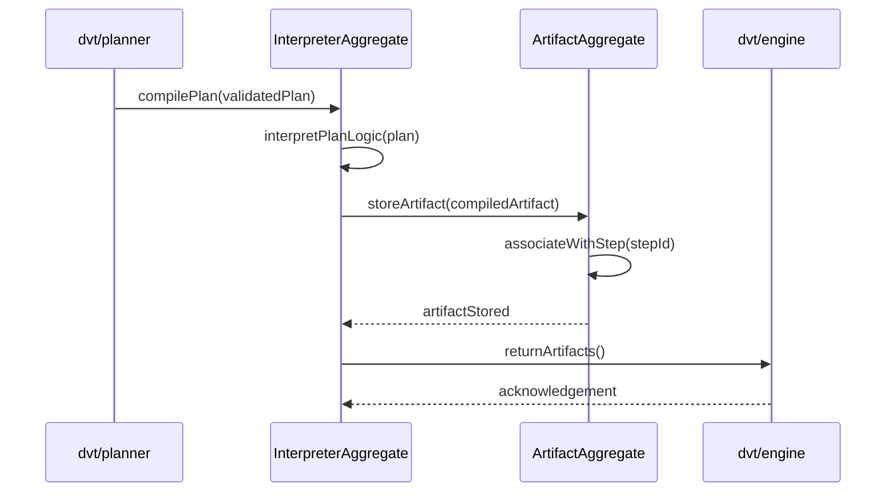

# interpreter Sequence

## Main Flow: Plan Compilation and Artifact Delivery

## Global Flow Position

`@dvt/plan-interpreter` sits between the planner and the engine in the DVT Planning Domain pipeline. The planner produces validated plans and sends them to the interpreter for compilation. The interpreter compiles each plan into execution-ready artifacts, stores them in the ArtifactAggregate, and then hands them off to `@dvt/engine` for workflow orchestration. The interpreter does not initiate requests — it is always invoked by the planner and always delivers to the engine.

## Key Files

- `packages/@dvt/planner/src/domain/types.ts` — Interpreter and artifact type definitions
- `packages/@dvt/planner/docs/contracts/PlannerContracts.v2.3.1.md` — Interpretation contract
