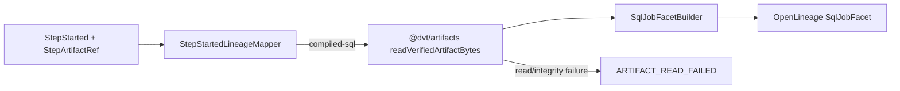

# Generic Artifact Lineage Extraction

## Owned Concern

Translate verified step artifacts into lineage facets without creating a second artifact identity, read, cache, resolver, or integrity authority.

## Public API

- `StepStartedLineageMapper`
- canonical runtime reference: `StepArtifactRef`
- canonical read/integrity operation: `@dvt/artifacts::readVerifiedArtifactBytes`
- SQL specialization: `SqlJobFacetBuilder`

## Invariants

1. `StepArtifactRef` is the only step artifact reference accepted by the mapper.
2. Artifact bytes, URI schemes, SHA-256 validation, and optional size validation belong to `@dvt/artifacts`.
3. Traceability owns no artifact reader/cache/resolver hierarchy.
4. `artifactKind = compiled-sql` is a legitimate lineage specialization: verified SQL bytes may produce the standard OpenLineage SQL Job Facet.
5. An absent reference produces no SQL facet. An unreadable referenced artifact fails open for lineage with a bounded `ARTIFACT_READ_FAILED` warning.
6. No direct `compiledCodeRef`, compatibility fallback, dual-read, or custom compiled-code facet exists.

## Transitions

```text
StepStarted
  -> parse StepArtifactRef
  -> non-SQL or absent: no SQL facet
  -> compiled-sql: readVerifiedArtifactBytes
       -> success: SqlJobFacet
       -> failure: ARTIFACT_READ_FAILED warning
```

## Consumers

- `apps/lineage-worker`
- `LineageWorkerRuntime`
- OpenLineage sink consumers of the standard SQL Job Facet

## Diagrams



## Drift Guards

- `packages/@dvt/artifacts/test/compiledCodeStorageRetirement.architecture.test.ts` prevents retired artifact authorities from returning to productive/public source.
- `packages/@dvt/traceability-service/test/lineage/StepStartedLineageMapper.test.ts` proves the canonical generic read path and fail-open behavior.
- `tools/ci/static-analysis-followup-branch-architecture.test.mjs` verifies this component boundary.

## Command and query catalog

| Rail                            | Type and bounded context                 | Object and application port                                | Adapter surface and scope                                                                | Negative cases                                                                               |
| ------------------------------- | ---------------------------------------- | ---------------------------------------------------------- | ---------------------------------------------------------------------------------------- | -------------------------------------------------------------------------------------------- |
| PublishContentAddressedArtifact | Command, Artifacts                       | Immutable artifact; IContentAddressedArtifactStore.publish | S3 CAS adapter; authenticated producer supplies matching tenant locator and bytes        | Tenant/URI mismatch, digest/size mismatch, conflicting existing bytes                        |
| ReadVerifiedArtifactBytes       | Query, Artifacts                         | Verified bytes read model; readVerifiedArtifactBytes       | Existing artifact transport adapters; caller-authorized reference and runtime URI policy | Production file URI denial, missing artifact, digest/size mismatch                           |
| MapStepStartedLineage           | Query, Traceability                      | SQL facet read model; ILineageStepEventMapper.map          | Existing lineage worker consuming scoped persisted lifecycle events                      | Unsupported/malformed reference, unreadable artifact, integrity mismatch; no legacy fallback |
| StartRun                        | Command, Run command application service | Admitted run; PlannerBackedStartRunUseCase                 | Existing protected StartRun HTTP command; authorized tenant/project/environment          | Removed step configuration, invalid generic reference, unauthorized scope                    |
| GetRunEvents                    | Query, Run events read model             | Event provenance; existing GetRunEvents application query  | Protected run-event API and Run workspace; authorized tenant/run scope                   | Missing/malformed generic artifact metadata, unauthorized run                                |

These catalog entries reuse the existing operations. The artifact and lineage
rails were absent from the consulted Planning DB catalog and are recorded through
RecordFeatureMechanizationRail for the hard cut. StartRun and GetRunEvents retain
their existing product identity and authorization boundaries. The existing API
run-context resolver translates generic integrity failure into the established
StartRun domain rejection; verification remains owned by the generic reader.

## Runtime configuration

The worker configures generic artifact transport through DVT_ARTIFACT_S3_ENDPOINT,
DVT_ARTIFACT_S3_REGION, DVT_ARTIFACT_S3_FORCE_PATH_STYLE and
DVT_ARTIFACT_FILE_READ_ROOT. The retired compiled-code resolver backend switch
has no replacement: there is one generic reader. Deployments must update their
configuration together with the ADR-0067 runtime/history boundary.
