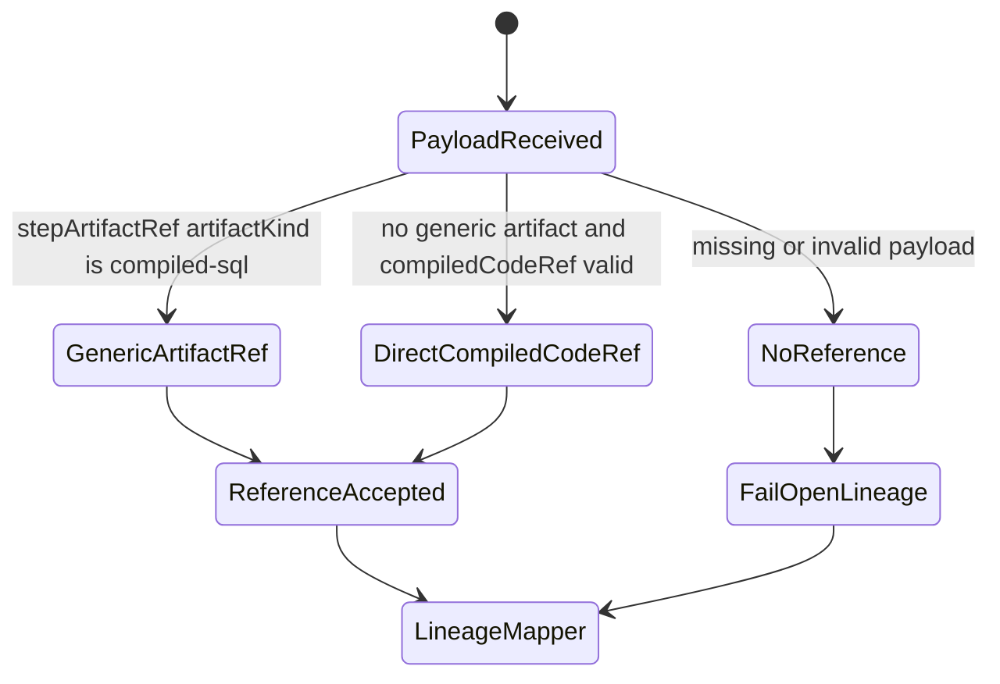
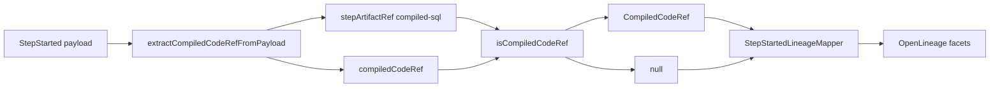
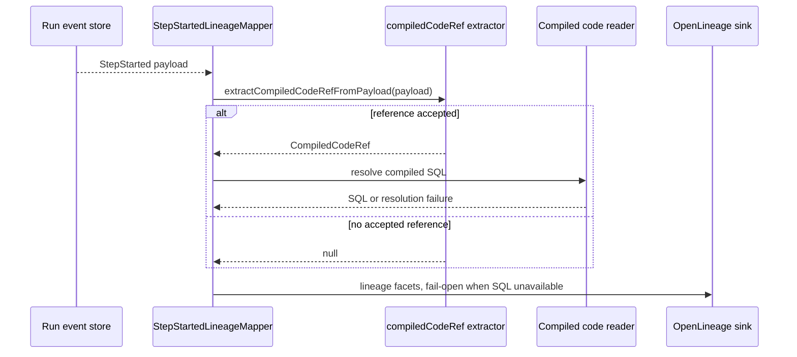

# Compiled-Code-Ref Lineage Extraction Component

## Owned Concern

This component owns extraction and validation of compiled-code references from
run-event payloads before lineage mapping builds OpenLineage facets.

It does not own artifact storage, run lifecycle truth, planner upload policy,
Temporal workflow execution, or OpenLineage sink delivery.

## Public API

- `extractCompiledCodeRefFromPayload(payload)`
  Reads a run-event payload and returns a canonical `CompiledCodeRef` when the
  payload carries a supported compiled SQL reference.
- `isCompiledCodeRef(value)`
  Type guard for SHA-256, storage URI, size, and encoding shape.
- `sha256HexUtf8(input)`
  Test and fixture helper for deterministic UTF-8 SHA-256 hashes.
- `stepArtifactRef`
  Preferred generic artifact payload candidate when `artifactKind` is
  `compiled-sql`.
- `compiledCodeRef`
  Direct ADR-0032 payload candidate retained for the accepted
  `StepStarted.payload.compiledCodeRef` contract.

## Invariants

- ADR-0032 remains the governing decision for `compiledCodeRef` ownership.
- Extraction must prefer generic `stepArtifactRef` with
  `artifactKind: 'compiled-sql'` before direct `compiledCodeRef`.
- Executor-prefixed artifact kinds such as `dbt.compiled-sql` must not be
  accepted by the generic extractor.
- The extractor returns `null` for missing, malformed, or unsupported payloads.
- A valid reference requires a non-empty storage URI, positive integer
  `sizeBytes`, a 64-character hexadecimal SHA-256 value, and optional
  `encoding: 'utf-8'`.
- The event log remains reference-only; compiled SQL bytes are not read or
  stored by this component.

## Transitions

## Consumers

- `StepStartedLineageMapper` uses the extractor before building lineage facets.
- `facetSchema.validation.test.ts` validates emitted facet shape.
- `StepStartedLineageMapper.golden.test.ts` protects golden lineage outputs.
- `compiledCodeRef.test.ts` protects accepted and rejected payload candidates.
- `apps/lineage-worker` wires traceability-service mapping into the runtime.

## Diagrams

## Fowler Reading

- **Gateway**:
  the extractor is the narrow gate between opaque event payloads and typed
  lineage mapping.
- **Null Object / Fail-Open Boundary**:
  `null` means lineage can continue without SQL facets when no valid reference
  exists.
- **Decision Table**:
  payload candidates are ordered by named helper functions instead of hidden
  inline conditionals.
- **Shared Kernel Contract**:
  `CompiledCodeRef` comes from `@dvt/contracts`; this component validates it
  but does not redefine it.

## Drift Guards

- `tools/ci/static-analysis-followup-branch-architecture.test.mjs` checks this
  guide, owned-concern docblocks, candidate order, and generic artifact-kind
  behavior.
- `packages/@dvt/traceability-service/test/lineage/compiledCodeRef.test.ts`
  covers valid direct references, valid generic artifact references,
  executor-prefixed rejections, and malformed payloads.
- `docs/adr/ADR-0032-compiledcoderef-ownership.md` remains the normative
  decision. A future first-class `ExecutionPlan` field requires a new ADR.
