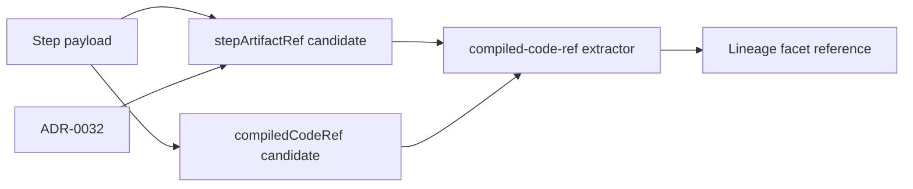

# Compiled-Code-Ref Lineage Extraction User Stories

## Purpose

This document captures the traceability scenarios for resolving compiled-code
references after ADR-0032 moved payload events toward lightweight artifact
references.

It complements the component guide:

- [Compiled-Code-Ref Lineage Extraction Component](./compiled-code-ref-lineage-extraction-component.md)

## User Stories

### US-LINEAGE-COMPILED-001: prefer artifact references from step payloads

As a lineage consumer, I want lineage extraction to prefer `stepArtifactRef`
payload references, so events stay lightweight while downstream lineage can
resolve compiled SQL artifacts consistently.

Acceptance criteria:

- Given a payload contains a valid `stepArtifactRef`, when lineage extraction
  runs, then the extracted value becomes the canonical compiled SQL reference.
- Given both `stepArtifactRef` and legacy direct `compiledCodeRef` candidates
  exist, then artifact reference precedence wins.
- Given ADR-0032 governance is active, then event payloads remain lightweight.

### US-LINEAGE-COMPILED-002: retain direct compiled-code fallback

As a traceability maintainer, I want direct `compiledCodeRef` candidates to
remain readable, so existing lightweight producers that already publish the
direct reference can still produce lineage without re-shaping payloads.

Acceptance criteria:

- Given no valid `stepArtifactRef` exists, when a valid `compiledCodeRef`
  exists, then it is extracted.
- Given a direct candidate is malformed, then it is ignored.
- Given no valid candidates exist, then extraction returns no reference instead
  of fabricating one.

### US-LINEAGE-COMPILED-003: fail closed on malformed payloads

As a platform operator, I want malformed lineage payloads to be ignored safely,
so the lineage worker does not publish invented compiled-code references.

Acceptance criteria:

- Given payload metadata is not an object, when extraction runs, then no
  compiled-code reference is emitted.
- Given candidate fields are non-string or incomplete, then extraction ignores
  them.
- Given extraction cannot resolve a reference, then the lineage event remains
  valid without a compiled-code reference.

### US-LINEAGE-COMPILED-004: validate semantic architecture drift

As an architect, I want branch-level architecture tests to validate extraction
order and documentation, so future cleanup cannot invert artifact precedence or
hide ADR-0032 ownership.

Acceptance criteria:

- Given the branch semantic guard reads `compiledCodeRef.ts`, then it finds
  separate helpers for artifact and direct extraction.
- Given the guard reads this document, then it finds success, fallback,
  negative scenarios, and ADR-0032 traceability.
- Given extraction order changes, then focused tests and the branch semantic
  guard fail.

## Negative Scenarios

- Malformed metadata must not throw or fabricate `compiledCodeRef`.
- Direct references must not override a valid `stepArtifactRef`.
- Extraction must not reintroduce concrete `dbt.compiled-sql` string matching.
- Documentation drift is a test failure when ADR-0032 traceability disappears.

## Given / When / Then Coverage

- Given a valid `stepArtifactRef`, When lineage extraction runs, Then the
  artifact reference becomes the compiled-code reference.
- Given no valid artifact reference exists, When a valid `compiledCodeRef`
  exists, Then the direct reference is used as fallback.
- Given malformed payload metadata, When extraction runs, Then no fabricated
  reference is emitted.

## Scenario Coverage Matrix

- `US-LINEAGE-COMPILED-001`: artifact reference first.
  Primary implementation: `compiledCodeRef.ts`.
  Primary tests: `compiledCodeRef.test.ts`.
- `US-LINEAGE-COMPILED-002`: direct reference fallback.
  Primary implementation: `compiledCodeRef.ts`.
  Primary tests: `compiledCodeRef.test.ts`.
- `US-LINEAGE-COMPILED-003`: malformed payload safety.
  Primary implementation: `compiledCodeRef.ts`.
  Primary tests: `compiledCodeRef.test.ts`.
- `US-LINEAGE-COMPILED-004`: semantic drift guard.
  Primary implementation: branch architecture guard.
  Primary tests: `static-analysis-followup-branch-architecture.test.mjs`.

## Traceability

Red case for this follow-up:

- the branch semantic guard required the lineage user-story document;
- the document did not exist;
- the guard failed before implementation.

Green case for this follow-up:

- add this story document;
- link it through component indexes and branch review material;
- rerun the guard and pre-push validation.
