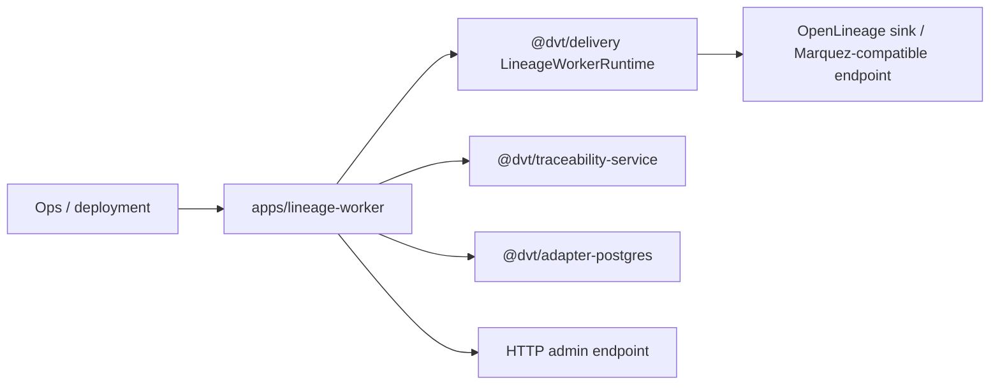

# dvt-lineage-worker

`dvt-lineage-worker` is the standalone lineage composition root under
`apps/lineage-worker`.

It hosts the shared lineage runtime, wires compiled-code resolution and sink
bootstrapping, exposes lag and dead-letter counters through an admin endpoint,
and keeps OpenLineage delivery downstream from runtime lifecycle ownership.

## Current Responsibilities

- bootstrap the worker process, sink, and lineage store wiring;
- build the step-started lineage mapper and compiled-code resolver path;
- run `LineageWorkerRuntime` with retry and dead-letter handling;
- report live lag and dead-letter backlog to operators.

## Interface Map

## Code Anchors

- [server.ts](../../../../apps/lineage-worker/src/server.ts)
- [bootstrap.ts](../../../../apps/lineage-worker/src/bootstrap.ts)
- [compiledCodeResolver.ts](../../../../apps/lineage-worker/src/compiledCodeResolver.ts)
- [LineageWorkerRuntime.ts](../../../../packages/@dvt/delivery/src/application/LineageWorkerRuntime.ts)
- [service.ts](../../../../packages/@dvt/traceability-service/src/service.ts)

## Current Posture

This component is active runtime code with explicit operational concerns:
mapper fidelity, sink delivery, and DLQ visibility all matter here.

## Planned Delta

- keep mapper and sink seams explicit as `S07` and `S11` continue to harden
  lineage behavior;
- preserve downstream-only ownership so lineage remains a consumer of runtime
  facts, not a second source of lifecycle truth;
- keep dead-letter and replay posture visible in the worker entry surface.

## Related Pages

- [Compiled-code-ref lineage extraction component](./compiled-code-ref-lineage-extraction-component.md)
- [@dvt/delivery](../delivery/index.md)
- [Delivery Domain](../../domain-delivery.md)
- [Shared Boundary Domain](../../domain-shared.md)
- [DVT Component Map](../../component-map.md)
