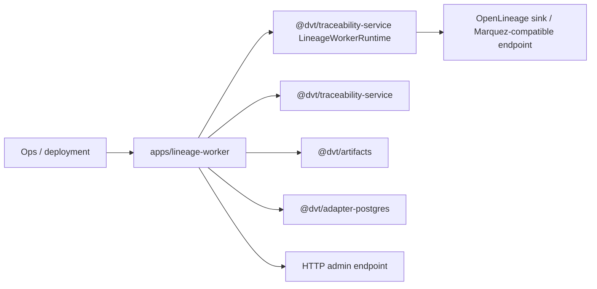

# dvt-lineage-worker

`dvt-lineage-worker` is the standalone lineage composition root under
`apps/lineage-worker`.

It hosts the shared lineage runtime, wires generic artifact-backed SQL lineage
extraction and sink bootstrapping, exposes lag and dead-letter counters through
an admin endpoint, and keeps OpenLineage delivery downstream from runtime
lifecycle ownership.

## Current Responsibilities

- bootstrap the worker process, sink, and lineage store wiring;
- build the `StepStartedLineageMapper` against the canonical generic artifact
  read/integrity path in `@dvt/artifacts`;
- run `LineageWorkerRuntime` with retry and dead-letter handling;
- report live lag and dead-letter backlog to operators.

## Interface Map

## Code Anchors

- [server.ts](../../../../apps/lineage-worker/src/server.ts)
- [bootstrap.ts](../../../../apps/lineage-worker/src/bootstrap.ts)
- [lineageMapper.ts](../../../../apps/lineage-worker/src/lineageMapper.ts)
- [StepStartedLineageMapper.ts](../../../../packages/@dvt/traceability-service/src/lineage/mapper/StepStartedLineageMapper.ts)
- [readVerifiedArtifactBytes.ts](../../../../packages/@dvt/artifacts/src/runtime/readVerifiedArtifactBytes.ts)

## Current Posture

This component is active runtime code with explicit operational concerns:
mapper fidelity, artifact-read integrity, sink delivery, and DLQ visibility all
matter here.

The worker does not own a compiled-code reader/cache/resolver subsystem. Artifact
identity, URI handling, bytes and integrity are delegated to the canonical
artifact boundary.

## Planned Delta

- preserve downstream-only ownership so lineage remains a consumer of runtime
  facts, not a second source of lifecycle truth;
- keep dead-letter and replay posture visible in the worker entry surface;
- do not reintroduce step-kind-specific artifact readers or compatibility paths.

## Related Pages

- [Generic artifact lineage extraction component](./artifact-lineage-extraction-component.md)
- [Generic artifact lineage extraction user stories](./artifact-lineage-extraction-user-stories.md)
- [@dvt/delivery](../delivery/index.md)
- [Delivery Domain](../../domain-delivery.md)
- [Shared Boundary Domain](../../domain-shared.md)
- [DVT Component Map](../../component-map.md)
