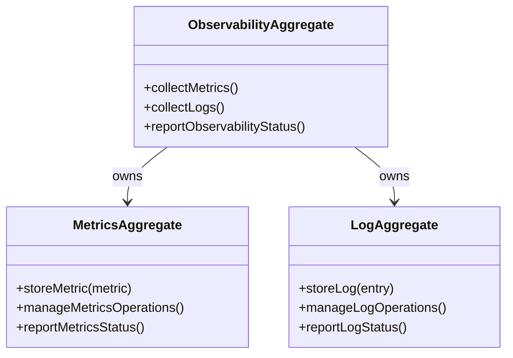

# observability DDD Structure

## DDD Diagram

## Aggregates & Entities

- **ObservabilityAggregate**: Central observability model owning metrics and log management. Coordinates collection and reporting of monitoring data across the DVT system.
- **MetricsAggregate**: Manages storage and lifecycle of system metrics, including ingestion, querying, and status reporting.
- **LogAggregate**: Manages storage and lifecycle of system logs, including ingestion, structured querying, and status reporting.

## Domain Events

- `MetricCollected`: Emitted when the MetricsAggregate successfully stores a new metric data point.
- `LogEntryCreated`: Emitted when the LogAggregate stores a new structured log entry.
- `ObservabilityStatusReported`: Emitted when the ObservabilityAggregate publishes a summary of the current monitoring state to the Shared Boundary Domain.

## Key Files

- `packages/@dvt/observability/src/` — Observability aggregate and sub-aggregate implementations
