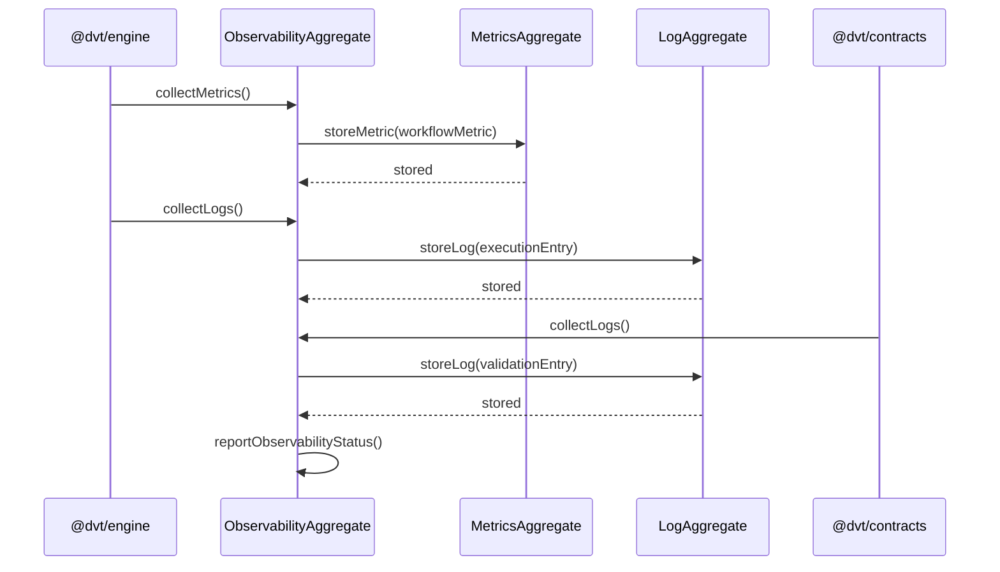

# observability Sequence

## Main Flow: Metrics and Log Collection During Workflow Execution

## Global Flow Position

`@dvt/observability` is a cross-cutting component in the Shared Boundary Domain. It is consumed by `@dvt/engine` to monitor workflow execution and by `@dvt/contracts` to record contract validation outcomes. It does not initiate interaction with other components — it is always called by the engine or contracts layer. Collected metrics and logs are reported upward to the Shared Boundary Domain for system-wide health monitoring. Observability operates asynchronously to avoid blocking the engine's critical execution path.

## Key Files

- `packages/@dvt/observability/src/` — ObservabilityAggregate, MetricsAggregate, and LogAggregate implementations
