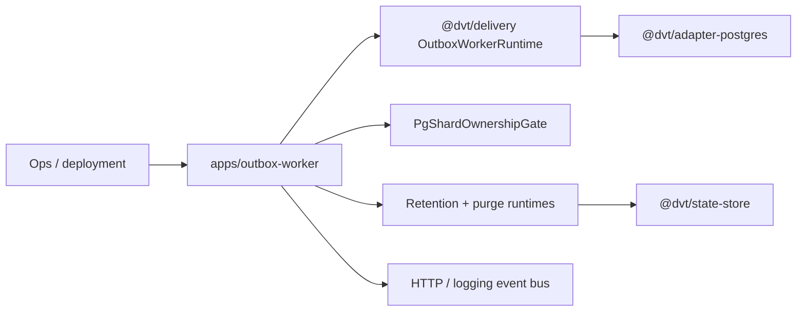

# dvt-outbox-worker

`dvt-outbox-worker` is the operational composition root under
`apps/outbox-worker`.

It hosts the delivery runtime in a standalone process and adds shard ownership,
operational endpoints, retention wiring, and purge support around the shared
`@dvt/delivery` runtime.

## Current Responsibilities

- start and stop the outbox runtime as a process host;
- expose operational monitoring endpoints;
- enforce shard ownership when running in fenced or distributed mode;
- wire retention and purge runtimes into the worker process.

## Interface Map

## Code Anchors

- [server.ts](../../../../apps/outbox-worker/src/server.ts)
- [runOutboxWorkerHost.ts](../../../../apps/outbox-worker/src/host/runOutboxWorkerHost.ts)
- [OperationalServer.ts](../../../../apps/outbox-worker/src/ops/OperationalServer.ts)
- [PgShardOwnershipGate.ts](../../../../apps/outbox-worker/src/ownership/PgShardOwnershipGate.ts)
- [DeliveryBufferPurgeRuntime.ts](../../../../apps/outbox-worker/src/runtime/DeliveryBufferPurgeRuntime.ts)

## Current Posture

This component is the delivery process host that operators actually run. Its
documentation needs to stay explicit because operational behavior here matters
as much as library behavior in `@dvt/delivery`.

## Planned Delta

- keep purge, retention, and shard ownership behavior explicit as event-lifecycle
  policy continues to harden;
- avoid leaking delivery runtime ownership back into unrelated composition
  roots.

## Historical Deep Dives

- [DDD Structure](outbox-worker-ddd.md)
- [Functionalities](outbox-worker-functional.md)
- [Constraints and invariants](outbox-worker-constraints.md)
- [Sequence diagrams](outbox-worker-sequence.md)
