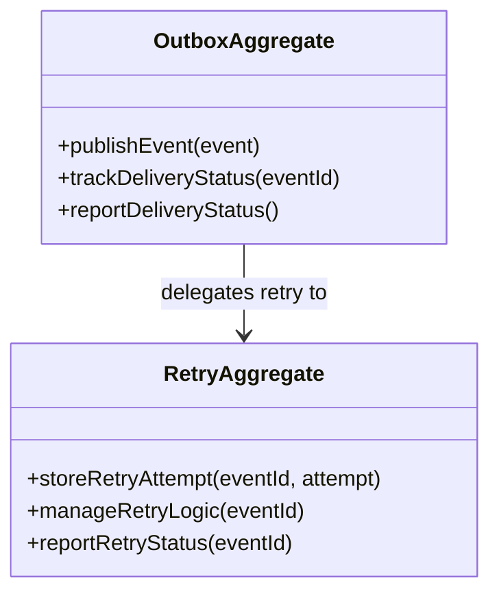

# outbox-worker DDD Structure

## DDD Diagram

## Aggregates & Entities

- **OutboxAggregate**: Central outbox model owning event publication and retry logic. Responsible for reliably publishing events to external systems and tracking delivery status.
- **RetryAggregate**: Manages the retry lifecycle for failed events, storing individual retry attempts and enforcing retry policies (backoff, max attempts).

## Domain Events

- `EventPublished`: Emitted when an event has been successfully delivered to an external system.
- `EventPublicationFailed`: Emitted when an event delivery attempt fails and a retry is scheduled.
- `RetryAttemptRecorded`: Emitted when the RetryAggregate stores a new retry attempt for a failed event.
- `DeliveryStatusReported`: Emitted when the OutboxAggregate reports current delivery status to the Delivery Domain.
- `EventMovedToDLQ`: Emitted when a failed event has exhausted all retry attempts and is moved to the dead-letter queue.

## Key Files

- `apps/outbox-worker/` — Outbox worker application
- `packages/@dvt/delivery/src/` — Delivery domain shared contracts and adapters
