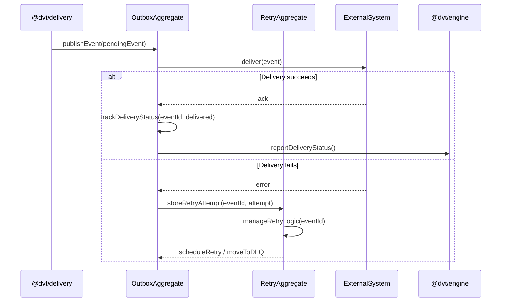

# outbox-worker Sequence

## Main Flow: Event Publication with Retry

## Global Flow Position

`dvt-outbox-worker` sits at the tail of the Delivery Domain pipeline. `@dvt/engine` emits domain events that are written to the outbox store, then `@dvt/delivery` hands ownership to the outbox worker for external publication. The worker is the only component responsible for dispatching events to external systems. On successful delivery it signals back to the engine; on repeated failure it escalates events to the dead-letter queue. The worker does not originate plans or drive workflow logic — it is purely a reliable delivery mechanism.

## Key Files

- `apps/outbox-worker/` — Outbox worker runtime application
- `packages/@dvt/delivery/src/` — Delivery domain contracts and ownership management
