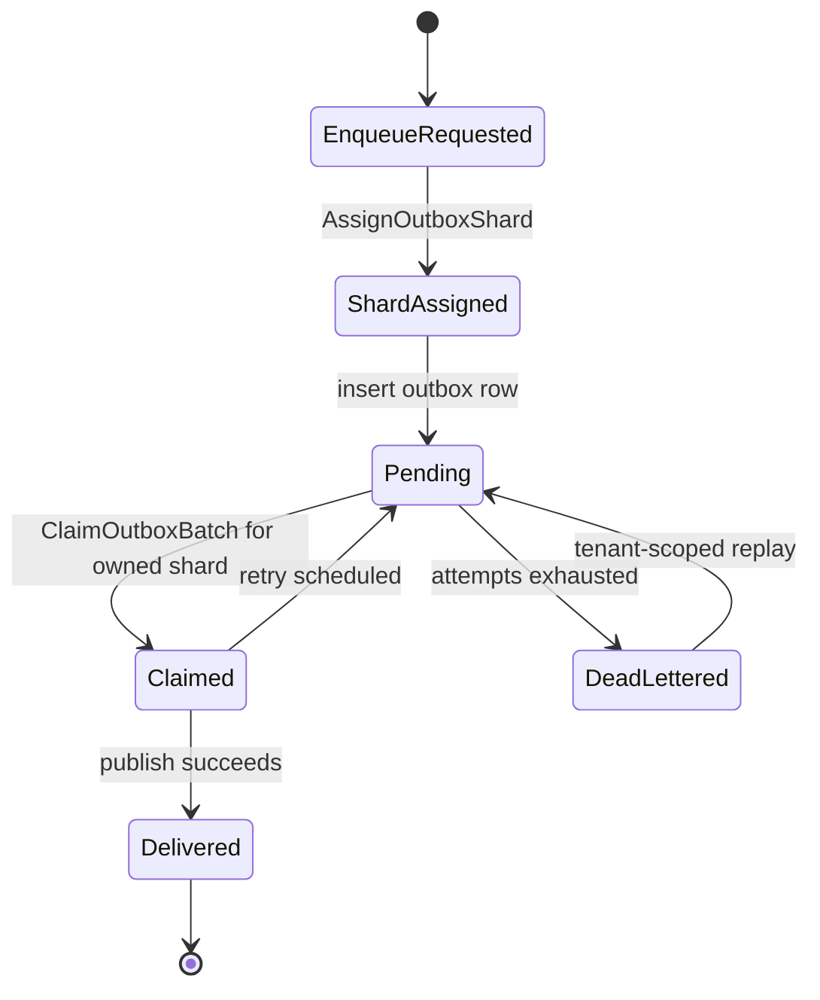
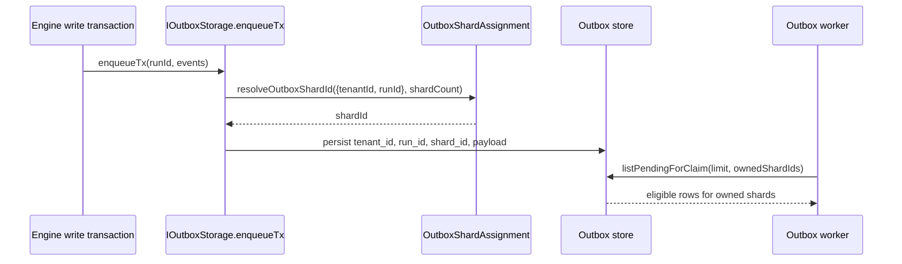

# Tenant-Aware Outbox Sharding Component

## Owned Concern

Tenant-aware outbox sharding owns the policy that assigns new transactional
outbox rows to persisted `shard_id` values before worker claim selection.

It does not own event publication, retry backoff, dead-letter replay, worker
process startup, or PostgreSQL advisory-lock ownership. Those remain separate
delivery runtime and host concerns.

## Public API

| API                                                       | Owner                | Purpose                                                                                                     |
| --------------------------------------------------------- | -------------------- | ----------------------------------------------------------------------------------------------------------- |
| `OutboxShardAssignmentKey`                                | `@dvt/delivery`      | Names the tenant/run identity used by the sharding policy.                                                  |
| `buildOutboxStreamOrderingKey(key)`                       | `@dvt/delivery`      | Builds the length-prefixed `(tenantId, runId)` stream key used by in-memory claim and dead-letter ordering. |
| `resolveOutboxShardId(key, shardCount)`                   | `@dvt/delivery`      | Pure query that returns the persisted shard id for a new outbox row.                                        |
| `IOutboxStorage.enqueueTx(runId, events)`                 | `@dvt/delivery` port | Adapter entrypoint that applies the policy when rows are persisted.                                         |
| `IOutboxStorage.listPendingForClaim(limit, { shardIds })` | `@dvt/delivery` port | Existing claim command boundary that filters by worker-owned shards.                                        |

## Invariants

- `tenantId` is mandatory for shard assignment.
- `shardCount` must be a positive integer.
- New rows are assigned by tenant-affine stable hash, not by run-only hash.
- Same tenant/run stream ordering is preserved by `(tenantId, runId, runSeq)`.
- In-memory ordering keys length-prefix tenant and run identifiers before
  joining them, so delimiter characters inside ids cannot merge streams.
- Dead-letter blocking is scoped to `(tenantId, runId)`.
- Existing rows keep their persisted `shard_id` until delivered, dead-lettered,
  or explicitly migrated.
- Workers claim only their configured shard ids.

## Transitions

## Sequence

## Consumers

- `packages/@dvt/delivery/src/testing/InMemoryOutboxStorage.ts`
- `packages/@dvt/engine/src/state/InMemoryOutboxState.ts`
- `packages/@dvt/adapter-postgres/src/PostgresOutboxStore.ts`
- `apps/outbox-worker/src/host/runOutboxWorkerHost.ts` through existing
  `IOutboxStorage` wiring
- `apps/outbox-worker/test/sharding/concurrentWorkerOrdering.test.ts`

## Rollout And Migration

The policy changes assignment for new rows. Existing rows keep their stored
`shard_id`.

Recommended rollout:

1. Keep `DVT_OUTBOX_SHARD_COUNT` unchanged.
2. Drain the current outbox backlog as far as practical.
3. Deploy write-side code and workers with the same shard count.
4. Keep owned shard coverage complete across active workers.
5. Monitor per-shard lag and per-tenant lag during the mixed old/new window.
6. Rebalance `ownedShardIds` only at explicit restart boundaries.

Changing `shardCount` remains a separate topology migration.

## Architecture Guard

`OutboxShardAssignment.architecture.test.ts` validates that:

- delivery owns the policy;
- engine delegates rather than re-implements the hash;
- PostgreSQL enqueue SQL includes tenant-aware hash input;
- docs no longer describe run-only shard assignment as current behavior.
