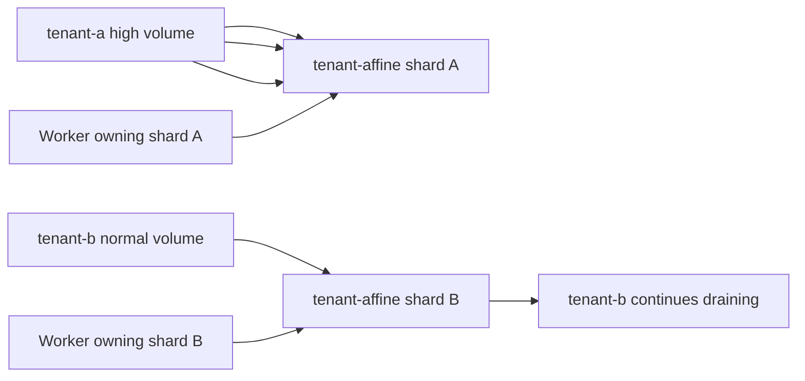

# Tenant-Aware Outbox Sharding User Stories

## Stories

| ID        | Actor                 | Story                                                                                                                                | Acceptance Criteria                                                                                                                              |
| --------- | --------------------- | ------------------------------------------------------------------------------------------------------------------------------------ | ------------------------------------------------------------------------------------------------------------------------------------------------ |
| AR-D7-US1 | Platform operator     | As an operator, I need one noisy tenant to stay bounded to its tenant-affine shard so unrelated tenant shards can continue draining. | Many runs for one tenant resolve to one shard; a second tenant mapped to another shard remains claimable by its worker.                          |
| AR-D7-US2 | Delivery developer    | As a developer, I need in-memory and PostgreSQL stores to use the same tenant-aware assignment semantics.                            | Delivery tests and adapter SQL tests prove the same tenant-affine policy; engine delegates instead of duplicating the algorithm.                 |
| AR-D7-US3 | Delivery developer    | As a developer, I need same `runId` values from different tenants to remain independent streams.                                     | A failed or dead-lettered record for tenant A does not block tenant B with the same `runId`.                                                     |
| AR-D7-US4 | Worker operator       | As an operator, I need shard ownership to remain explicit after the policy change.                                                   | Workers still claim by configured `ownedShardIds`; empty or invalid shard selections fail closed.                                                |
| AR-D7-US5 | Release owner         | As a release owner, I need a rollout rule for persisted old rows.                                                                    | Runbook states that existing rows keep stored `shard_id`, new rows use tenant-aware assignment, and shard-count changes are separate migrations. |
| AR-D7-US6 | Architecture reviewer | As a reviewer, I need a semantic guard against returning to run-only hashing.                                                        | Architecture test fails if docs or source reintroduce run-only shard assignment as current behavior.                                             |
| AR-D7-US7 | Engine maintainer     | As a maintainer, I need Engine to expose a semantic compatibility facade instead of a raw barrel.                                    | Engine facade has an owned-concern docblock, named functions, explicit Delivery delegation, and no local hash implementation.                    |

## Scenario Diagram

## Negative Scenarios

- Missing `tenantId` must not silently hash as an unscoped tenant.
- `shardCount <= 0` must fail before routing.
- Dead-letter replay must keep tenant scope and stored shard ownership.
- A worker with no owned shards must claim nothing.
- Documentation that states `stableHash(runId) % shardCount` as current behavior
  must fail the semantic architecture guard.
- Replacing the Engine facade with a raw `export from '@dvt/delivery'` barrel
  must fail the architecture guard.
