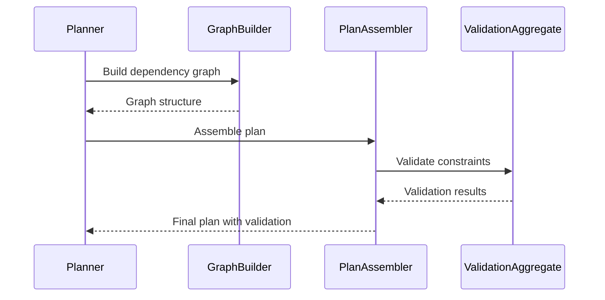
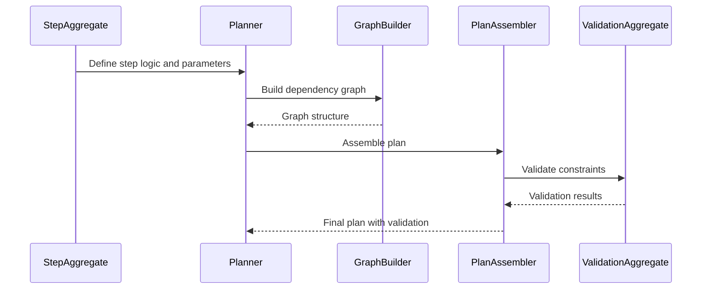
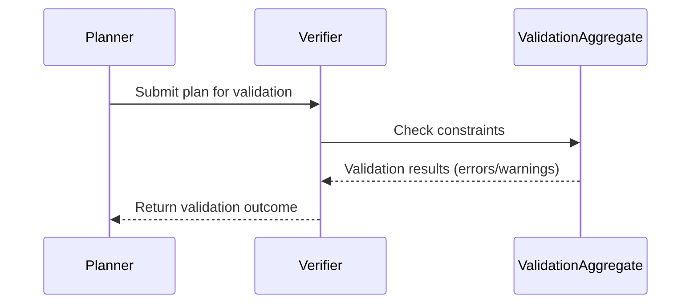

# Planner Aggregates

## [PlanAggregate](planner-aggregates.md#planaggregate)

Represents the central plan model, owning all steps and dependencies. Responsible for:

- Managing the overall plan structure
- Tracking dependencies between steps
- Enforcing plan constraints

**Plan schema:** See [ExecutionPlanV2](../../packages/@dvt/contracts/src/contracts/planner/ExecutionPlan.v2.ts)
**Input schema:** See [PlannerInputEnvelopeSchema](../../packages/@dvt/contracts/src/planner-input.ts)

### Relationships and Source Files

PlanAggregate is implemented and orchestrated mainly in:

- [Planner.ts](../../packages/@dvt/planner/src/domain/Planner.ts): Orchestrates plan building, validation, dependency tracking, and constraint enforcement.
- [GraphBuilder.ts](../../packages/@dvt/planner/src/domain/graph/GraphBuilder.ts): Builds and validates the dependency graph between steps.
- [TopoSort.ts](../../packages/@dvt/planner/src/domain/graph/TopoSort.ts): Orders steps topologically to respect dependencies.
- [InputEnvelopeValidator.ts](../../packages/@dvt/planner/src/domain/InputEnvelopeValidator.ts): Validates the input envelope shape.
- [ManifestGraphDeriver.ts](../../packages/@dvt/planner/src/domain/manifest.ts): Derives nodes from external manifests.
- [PlanAssembler.ts](../../packages/@dvt/planner/src/domain/PlanAssembler.ts): Assembles the final plan, calculates hashes and metadata.
- [StepFactory/StepFactory.ts](../../packages/@dvt/planner/src/domain/stepFactory/StepFactory.ts): Creates steps, applies policies and configurations.
- [policies.ts](../../packages/@dvt/planner/src/domain/policies.ts): Resolves execution policies and constraints.
- [planner-input.ts](../../packages/@dvt/contracts/src/planner-input.ts): Defines input schema, step types, dependencies, and constraints.
- [planner.contract.test.ts](../../packages/@dvt/contracts/test/planner.contract.test.ts), [plannerEngineContract.test.ts](../../apps/api/test/integration/plannerEngineContract.test.ts): Validate plan behavior and constraints.

### What does it do?

- Manages the global structure of the plan.
- Tracks dependencies between steps using a graph.
- Applies and validates constraints defined by policies, limits, and step configurations.
- Assembles the final plan, ensuring determinism and constraint validation.

### Example Constraints Enforced

- Steps must not have circular dependencies (acyclic graph).
- All required parameters for each step must be defined.
- Plan must comply with domain-specific business rules.
- Steps must be executable in the defined order.

### Sequence Diagram: PlanAggregate Constraint Enforcement

## [StepAggregate](planner-aggregates.md#stepaggregate)

Represents an individual step within a plan. Responsible for:

- Defining step logic and parameters
- Linking to other steps as dependencies
- Reporting execution status

**Step types:** See [WorkflowStepTypeSchema](../../packages/@dvt/contracts/src/planner-input.ts) (`task`, `gateway`)

### Relationships and Source Files

StepAggregate is implemented and orchestrated mainly in:

- [StepFactory/StepFactory.ts](../../packages/@dvt/planner/src/domain/stepFactory/StepFactory.ts): Creates steps, applies policies and configurations.
- [policies.ts](../../packages/@dvt/planner/src/domain/policies.ts): Resolves execution policies and constraints.
- [planner-input.ts](../../packages/@dvt/contracts/src/planner-input.ts): Defines input schema, step types, dependencies, and constraints.
- [planner.contract.test.ts](../../packages/@dvt/contracts/test/planner.contract.test.ts), [plannerEngineContract.test.ts](../../apps/api/test/integration/plannerEngineContract.test.ts): Validate plan behavior and constraints.

### What does it do?

- Defines step logic and parameters.
- Links to other steps as dependencies.
- Reports execution status.

### Example Constraints Enforced

- Steps must not have circular dependencies (acyclic graph).
- All required parameters for each step must be defined.
- Plan must comply with domain-specific business rules.
- Steps must be executable in the defined order.

### Sequence Diagram: StepAggregate Constraint Enforcement

## [ValidationAggregate](planner-aggregates.md#validationaggregate)

Represents validation results for a plan. Responsible for:

- Storing validation outcomes
- Associating errors/warnings with steps
- Enabling plan integrity checks

**Validation schema:** See [ValidationAggregate types](../../packages/@dvt/planner/src/domain/types.ts)
**Validation tests:** See [capabilities.contract.test.ts](../../packages/@dvt/engine/test/contracts/capabilities.contract.test.ts)

### Relationships and Source Files

ValidationAggregate is implemented and orchestrated mainly in:

- [Planner.ts](../../packages/@dvt/planner/src/domain/Planner.ts): Orchestrates plan building, validation, dependency tracking, and constraint enforcement.
- [GraphBuilder.ts](../../packages/@dvt/planner/src/domain/graph/GraphBuilder.ts): Builds and validates the dependency graph between steps.
- [TopoSort.ts](../../packages/@dvt/planner/src/domain/graph/TopoSort.ts): Orders steps topologically to respect dependencies.
- [InputEnvelopeValidator.ts](../../packages/@dvt/planner/src/domain/InputEnvelopeValidator.ts): Validates the input envelope shape.
- [ManifestGraphDeriver.ts](../../packages/@dvt/planner/src/domain/manifest.ts): Derives nodes from external manifests.
- [PlanAssembler.ts](../../packages/@dvt/planner/src/domain/PlanAssembler.ts): Assembles the final plan, calculates hashes and metadata.
- [StepFactory/StepFactory.ts](../../packages/@dvt/planner/src/domain/stepFactory/StepFactory.ts): Creates steps, applies policies and configurations.
- [policies.ts](../../packages/@dvt/planner/src/domain/policies.ts): Resolves execution policies and constraints.
- [planner-input.ts](../../packages/@dvt/contracts/src/planner-input.ts): Defines input schema, step types, dependencies, and constraints.
- [planner.contract.test.ts](../../packages/@dvt/contracts/test/planner.contract.test.ts), [plannerEngineContract.test.ts](../../apps/api/test/integration/plannerEngineContract.test.ts): Validate plan behavior and constraints.

### What does it do?

- Stores validation outcomes.
- Associates errors/warnings with steps.
- Enables plan integrity checks.

### Example Constraints Enforced

- Steps must not have circular dependencies (acyclic graph).
- All required parameters for each step must be defined.
- Plan must comply with domain-specific business rules.
- Steps must be executable in the defined order.

### Sequence Diagram: ValidationAggregate Constraint Enforcement

## Responsibilities

- Root: [PlanAggregate](planner-aggregates.md#planaggregate) (central plan model)
- Aggregates: [StepAggregate](planner-aggregates.md#stepaggregate), [ValidationAggregate](planner-aggregates.md#validationaggregate)
- Ensures plan structure, dependencies, and constraints
- Coordinates plan lifecycle (draft, compiled, validated)
- Create new plans and edit existing ones.
- Manage plan structure, dependencies, and constraints.
- Coordinate plan compilation and validation.
- Transition plans through lifecycle states (draft, compiled, validated).

## Interactions

- [Verifier](verifier.md): Receives plans from planner, checks integrity, returns validation results.
- [Interpreter](interpreter.md): Receives compiled plans, interprets for execution, returns execution-ready artifacts.
- [DSL](dsl.md): Provides domain-specific language for plan definition, used by planner to enable flexible plan creation.

Planner orchestrates these interactions to ensure every plan is valid, executable, and compliant with system constraints.

## Constraints

Constraints are rules and requirements that plans must satisfy to be considered valid. They are enforced during validation and compilation.

### Examples of Constraints

- Step dependencies must be acyclic (no circular dependencies).
- All required parameters for each step must be defined.
- Plan must comply with domain-specific business rules.
- Steps must be executable in the defined order.

### Sources

- [PlannerContracts.v2.3.1.md](../../packages/@dvt/planner/docs/contracts/PlannerContracts.v2.3.1.md) — formal contract definitions.
- [types.ts](../../packages/@dvt/planner/src/domain/types.ts) — plan and step types.
- [ExecutionPlan.v2.ts](../../packages/@dvt/contracts/src/contracts/planner/ExecutionPlan.v2.ts) — execution plan schema.
- [capabilities.contract.test.ts](../../packages/@dvt/engine/test/contracts/capabilities.contract.test.ts) — test cases for constraints.

### Sequence Diagram: Constraint Validation

