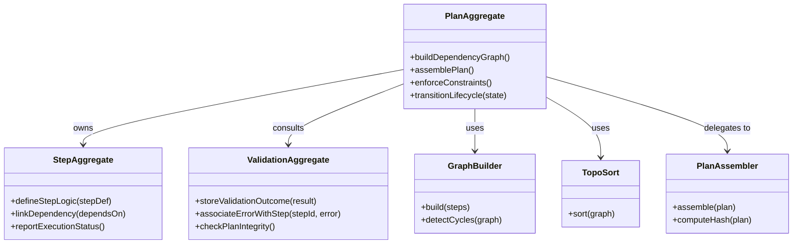

# planner-aggregates DDD Structure

## DDD Diagram

## Aggregates & Entities

- **PlanAggregate**: Central plan model owning all steps and dependencies. Manages global plan structure, tracks inter-step dependencies, enforces constraints, and coordinates lifecycle transitions (draft → compiled → validated).
- **StepAggregate**: Represents an individual executable step. Defines step logic, parameters, dependency links, and reports execution status. Step types include `task` and `gateway`.
- **ValidationAggregate**: Stores validation results for a plan. Associates errors and warnings with specific steps and enables plan integrity checks before lifecycle transitions.

## Domain Events

- `PlanAssembled`: Emitted by PlanAssembler when the final `ExecutionPlanV2` is produced with its hash and metadata.
- `ConstraintViolationDetected`: Emitted by ValidationAggregate when a constraint check fails (e.g., circular dependency, missing parameter).
- `DependencyGraphBuilt`: Emitted by GraphBuilder after successfully constructing the DAG from step definitions.
- `StepOrderDetermined`: Emitted by TopoSort after computing a valid topological execution order.
- `PlanLifecycleTransitioned`: Emitted by PlanAggregate when a plan moves from one lifecycle state to the next.

## Key Files

- `packages/@dvt/planner/src/domain/Planner.ts` — PlanAggregate orchestration
- `packages/@dvt/planner/src/domain/graph/GraphBuilder.ts` — Dependency graph construction and cycle detection
- `packages/@dvt/planner/src/domain/graph/TopoSort.ts` — Topological step ordering
- `packages/@dvt/planner/src/domain/PlanAssembler.ts` — Plan assembly and hash computation
- `packages/@dvt/planner/src/domain/stepFactory/StepFactory.ts` — StepAggregate creation
- `packages/@dvt/planner/src/domain/policies.ts` — Policy and constraint resolution
- `packages/@dvt/planner/src/domain/types.ts` — Aggregate and entity type definitions
- `packages/@dvt/contracts/src/contracts/planner/ExecutionPlan.v2.ts` — ExecutionPlan schema
- `packages/@dvt/contracts/src/planner-input.ts` — Input envelope and step type schemas
