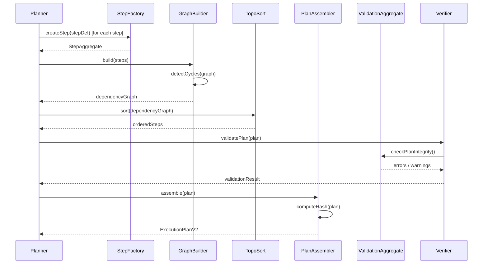

# planner-aggregates Sequence

## Main Flow: Constraint Enforcement and Plan Assembly

## Global Flow Position

The planner aggregates (`PlanAggregate`, `StepAggregate`, `ValidationAggregate`) form the domain model at the heart of `@dvt/planner`. They are orchestrated exclusively by the Planner service, which is triggered by the API or DSL consumers. GraphBuilder and TopoSort operate on the aggregate data to produce a valid, ordered execution graph. PlanAssembler produces the final `ExecutionPlanV2` output. The assembled plan is then handed to `@dvt/plan-interpreter` for compilation, which in turn delivers execution artifacts to `@dvt/engine`. No aggregate reaches directly into the delivery, infra, or observability domains.

## Key Files

- `packages/@dvt/planner/src/domain/Planner.ts` — Aggregate orchestration
- `packages/@dvt/planner/src/domain/graph/GraphBuilder.ts` — Graph construction and cycle detection
- `packages/@dvt/planner/src/domain/graph/TopoSort.ts` — Topological ordering
- `packages/@dvt/planner/src/domain/PlanAssembler.ts` — Plan assembly and hash computation
- `packages/@dvt/planner/src/domain/stepFactory/StepFactory.ts` — StepAggregate creation
- `packages/@dvt/planner/src/domain/types.ts` — Type definitions
- `packages/@dvt/contracts/src/contracts/planner/ExecutionPlan.v2.ts` — Output schema
