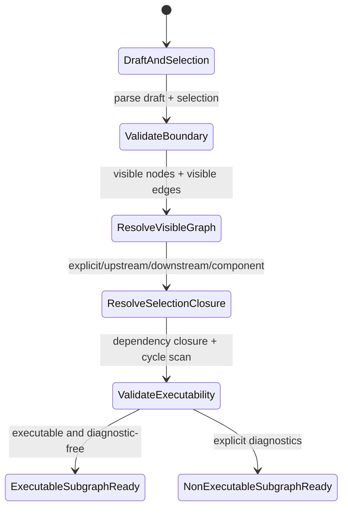
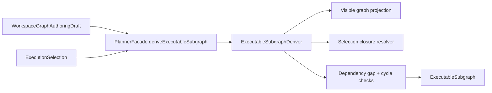

# Executable subgraph derivation component

This local component guide describes the planner-owned derivation seam that
turns editable authoring truth plus operator intent into one executable
selected-closure read model.

The normative sources remain:

- `packages/@dvt/contracts/src/contracts/planner/WorkspaceGraphAuthoringDraft.v1.ts`
- `packages/@dvt/contracts/src/contracts/planner/ExecutionSelection.v1.ts`
- `packages/@dvt/contracts/src/contracts/planner/ExecutableSubgraph.v1.ts`
- [Execution selection and executable subgraph v1](../../../contracts/planner/execution-selection-and-executable-subgraph-v1.md)
- [TF-A2-C execution selection and executable subgraph plan](../../../planning/proposals/mandatory/runtime-and-contracts/tf-a2-c-execution-selection-and-executable-subgraph-plan-20260423.md)

## Owned concern

The component owns one decision only:

- derive the selected closure from `WorkspaceGraphAuthoringDraft` and
  `ExecutionSelection`
- answer whether that closure is executable without widening to the whole draft
- emit explicit diagnostics when the selected closure is invalid or incomplete

It does not own compile-step construction, runtime admission, auth,
capabilities, compare-and-swap, audit, or UI-only selection state.

## Public API

- `PlannerFacade#deriveExecutableSubgraph`
  Public planner boundary for selected-closure derivation.
- `ExecutableSubgraphDeriver`
  Planner-local application service that validates authoring truth, resolves
  the selected closure, and emits canonical diagnostics.
- `WorkspaceGraphAuthoringDraft`
  Editable aggregate input.
- `ExecutionSelection`
  Operator-intent command input.
- `ExecutableSubgraph`
  Derived read model returned by the derivation seam.

## Invariants

- only visible `draft.nodeIds` participate in traversal and executability
  checks
- selected closures are deterministic and sorted by planner binary ordering
- derivation never mutates the draft
- derivation never widens from selected scope to whole-draft scope
- `explicit` mode keeps exactly the requested visible node ids and reports
  missing upstream dependencies as `dependency_gap`
- `upstream` mode includes transitive visible dependencies
- `downstream` mode includes transitive visible dependents and still fails
  closed if resulting nodes depend on visible-external nodes
- `connected_component` mode resolves the visible undirected component and
  still validates dependency closure
- cycle detection is evaluated on the derived selected closure only
- hidden or missing selected node ids fail closed as `selected_node_missing`

## Transitions

## Component map

## Diagnostics posture

- `selected_node_missing`
  One or more selected node ids are not visible in the authoring draft.
- `dependency_gap`
  The derived closure omits one or more required upstream dependencies.
- `cycle_detected`
  The derived closure contains a cycle.
- `unsupported_selection_mode`
  Reserved fail-closed posture if planner derivation receives a mode it does
  not implement.

## Consumers

- `packages/@dvt/planner/src/application/PlannerFacade.ts`
- `packages/@dvt/planner/src/application/ExecutableSubgraphDeriver.ts`
- `packages/@dvt/planner/test/unit/executable-subgraph-deriver.test.ts`
- `packages/@dvt/planner/test/unit/executable-subgraph-deriver.architecture.test.ts`
- API preview/run adoption slices under `TF-A2-C3`
- web Canvas adoption slices under `TF-A2-C4`

## Extension rules

- add relation-sensitive execution semantics only with one documented planner
  policy, not route-local rewrites
- add new selection modes only when derivation semantics and diagnostics are
  documented and tested in the same slice
- keep `ExecutableSubgraph` derived and transient; do not persist it
- keep compile-step mapping in compile seams, not in this derivation component
