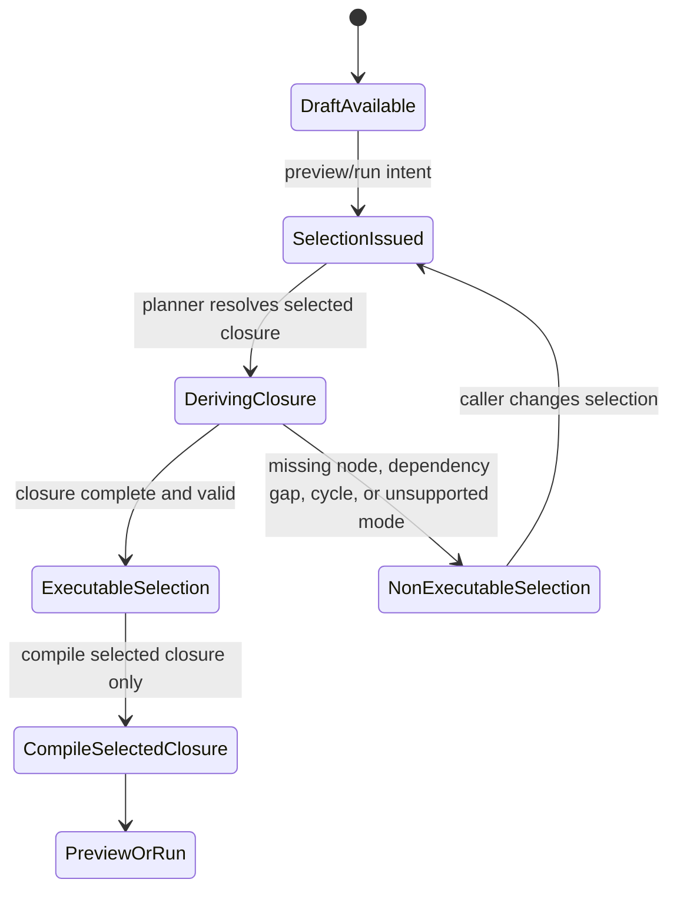
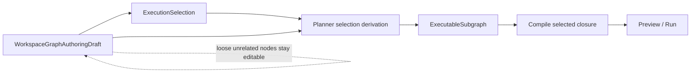

# Execution selection component

This local component guide describes the planner-facing contract component that
freezes preview/run intent and the derived selected-closure read model for
workspace authoring drafts.

The normative contract sources remain:

- `packages/@dvt/contracts/src/contracts/planner/ExecutionSelection.v1.ts`
- `packages/@dvt/contracts/src/contracts/planner/ExecutableSubgraph.v1.ts`
- `packages/@dvt/contracts/src/contracts/planner/index.ts`
- `packages/@dvt/contracts/src/schemas.ts`
- `packages/@dvt/contracts/src/validation.ts`
- [Execution selection and executable subgraph v1](../../../contracts/planner/execution-selection-and-executable-subgraph-v1.md)

## Owned concern

The component owns two things only:

- operator intent for preview/run over an editable authoring draft
- the derived selected-closure read model returned before compile or run

`@dvt/contracts` freezes the vocabulary and shape. The planner owns closure
derivation. This component does not own mutable draft state, persistence
envelopes, auth, compare-and-swap, audit, or runtime admission.

`ExecutableSubgraph` is not a second persisted draft family.

## Public API

- `ExecutionSelection`
  Canonical preview/run command input with one selection mode and one or more
  selected node ids.
- `EXECUTION_SELECTION_MODE`
  Closed mode vocabulary: `explicit`, `upstream`, `downstream`,
  `connected_component`.
- `ExecutionSelectionSchema`
  Canonical runtime validator for selection intent payloads.
- `ExecutableSubgraph`
  Derived selected-closure read model used to answer executability and
  diagnostics before compile or run.
- `EXECUTABLE_SUBGRAPH_DIAGNOSTIC_CODE`
  Closed diagnostic vocabulary for invalid or incomplete selected closures.
- `ExecutableSubgraphSchema`
  Canonical runtime validator for selected-closure payloads.
- `parseExecutionSelection`
  Boundary parser exported from `@dvt/contracts/validation`.
- `parseExecutableSubgraph`
  Boundary parser exported from `@dvt/contracts/validation`.

## Invariants

- `ExecutionSelection.nodeIds` is non-empty.
- `ExecutionSelection.nodeIds` is unique.
- selection mode comes from one closed vocabulary.
- selection payloads do not carry persistence, scope, capability, CAS, audit,
  or runtime-admission fields.
- `ExecutableSubgraph.selection` always reuses the canonical
  `ExecutionSelection` contract.
- `ExecutableSubgraph.nodeIds` is unique.
- `ExecutableSubgraph.edgeIds` is unique.
- executable closures contain at least one node id.
- executable closures must not carry diagnostics.
- non-executable closures must carry one or more diagnostics.
- planner owns closure derivation; contracts only freeze the boundary shape.

## Transitions

## Diagnostic taxonomy

- `selected_node_missing`
  One or more selected node ids do not exist in the authoring draft.
- `dependency_gap`
  The selected closure is incomplete for preview/run semantics.
- `cycle_detected`
  The selected closure contains a cycle that blocks compile or run.
- `unsupported_selection_mode`
  The caller asks for a selection mode the current derivation seam does not
  support.

## Component map

## Consumers

- `packages/@dvt/contracts/src/index.ts`
- `packages/@dvt/contracts/src/schema-packs/execution-selection.ts`
- `packages/@dvt/contracts/src/validation/planner.ts`
- `packages/@dvt/contracts/test/execution-selection.contract.test.ts`
- `packages/@dvt/contracts/test/execution-selection.architecture.test.ts`
- `packages/@dvt/planner/src/application/PlannerFacade.ts`
- `packages/@dvt/planner/src/application/ExecutableSubgraphDeriver.ts`
- `packages/@dvt/planner/test/unit/executable-subgraph-deriver.test.ts`
- `packages/@dvt/planner/test/unit/executable-subgraph-deriver.architecture.test.ts`
- `apps/api/src/application/services/resolveAuthorizedExecutableSubgraph.ts`
- `apps/api/src/application/services/PreviewPlanUseCase.ts`
- `apps/api/src/application/services/PlannerBackedStartRunUseCase.ts`
- `apps/web/src/app/views/canvas/canvasRunSelection.ts`
- `apps/web/src/app/views/canvas/canvasPlanAction.ts`
- `apps/web/src/app/views/canvas/canvasRunStartAction.ts`
- [Executable subgraph derivation component](./executable-subgraph-derivation-component.md)

## Extension rules

- add new selection modes only when planner derivation semantics are documented
  and tested in the same slice
- do not add scope, capability, revision, idempotency, audit, or runtime
  admission fields to `ExecutionSelection`
- do not persist `ExecutableSubgraph`
- keep diagnostic codes closed and intention-revealing
- keep authoring truth in `WorkspaceGraphAuthoringDraft` and compile truth in
  planner/compiler artifacts
