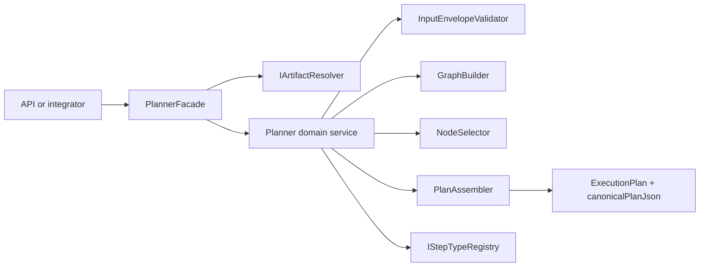

# @dvt/planner

## Canonical reading order

1. [Planner current state assessment](../../../planning/status/planner-current-state-assessment-20260320.md)
2. [Planner contracts](../../../contracts/planner/index.md)
3. [GenericGraphSource technical manual](../../../guides/generic-graph-source-technical-manual-20260404.md)
4. [GenericGraphSource user manual](../../../guides/generic-graph-source-user-manual-20260404.md)
5. [MW-A2 GenericGraphSource plan](../../../planning/proposals/mandatory/runtime-and-contracts/mw-a2-generic-graph-source-plan-20260404.md)

## Scope and location

- package: `packages/@dvt/planner`
- domain: [Planning domain](../../domain-planning.md)
- shared contract surfaces: `packages/@dvt/contracts/src/contracts/planner/**`

## Current truth

- public boundary: `PlannerFacade`
- public envelope: `PlannerInputEnvelopeV2`
- canonical production ingress: `manifestRef`
- typed inline ingress: `graphSource`
- compatibility ingress: `manifest`, `nodes`
- active dbt normalization seam: `derivePlannerGraphSourceFromManifest` plus API-side resolver wiring

## Target truth (MW-A2)

- canonical planner input evolves toward `GenericGraphSourceV1`
- dbt manifest ingestion remains supported as a compatibility adapter path
- non-dbt graph sources become first-class at planner ingress
- runtime executability for non-dbt kinds remains sequenced behind `MW-A1`, `MW-A3`, and `MW-C1`

## Component map (current)

## Primary code anchors

- [PlannerFacade.ts](../../../../packages/@dvt/planner/src/application/PlannerFacade.ts)
- [Planner.ts](../../../../packages/@dvt/planner/src/domain/Planner.ts)
- [PlanAssembler.ts](../../../../packages/@dvt/planner/src/domain/PlanAssembler.ts)
- [InputEnvelopeValidator.ts](../../../../packages/@dvt/planner/src/domain/InputEnvelopeValidator.ts)
- [IArtifactResolver.ts](../../../../packages/@dvt/planner/src/ports/IArtifactResolver.ts)
- [ExecutionPlan.v2.ts](../../../../packages/@dvt/contracts/src/contracts/planner/ExecutionPlan.v2.ts)

## Notes

- This page replaces stale aggregate-centric references that no longer match the shipped planner code.
- If this page and another planner doc disagree, use the documents listed under "Canonical reading order" as source of truth.
