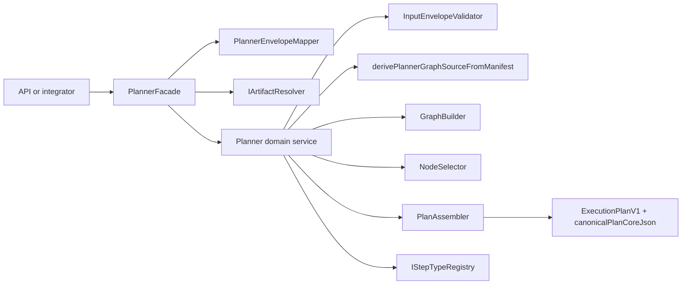

# @dvt/planner

## Canonical reading order

1. [Planner current state assessment](../../../planning/status/planner-current-state-assessment-20260320.md)
2. [Planner contracts](../../../contracts/planner/index.md)
3. [GenericGraphSource technical manual](../../../guides/generic-graph-source-technical-manual-20260404.md)
4. [GenericGraphSource user manual](../../../guides/generic-graph-source-user-manual-20260404.md)
5. [Planner cycle detection technical manual](../../../guides/planner-cycle-detection-technical-manual-20260404.md)
6. [Planner cycle detection user manual](../../../guides/planner-cycle-detection-user-manual-20260404.md)
7. [MW-A2 GenericGraphSource plan](../../../planning/proposals/mandatory/runtime-and-contracts/mw-a2-generic-graph-source-plan-20260404.md)

## Scope and location

- package: `packages/@dvt/planner`
- domain: [Planning domain](../../domain-planning.md)
- public contract surfaces: `packages/@dvt/contracts/src/contracts/planner/**`

## Current truth

- public boundary: `PlannerFacade`
- public envelope: `PlannerInputEnvelopeV1`
- canonical plan artifact: `ExecutionPlan.v1.ts`
- canonical production ingress: `manifestRef`
- typed inline ingress: `graphSource`
- compatibility ingress: `manifest`, `nodes`
- active dbt normalization seam: `derivePlannerGraphSourceFromManifest`

## Target truth

- canonical planner input evolves toward `GenericGraphSourceV1`
- dbt manifest ingestion remains a compatibility adapter path
- non-dbt graph sources become first-class at planner ingress
- planner component pages stay summary-only and point back to canonical planner docs

## Component map

## Primary code anchors

- [PlannerFacade.ts](../../../../packages/@dvt/planner/src/application/PlannerFacade.ts)
- [PlannerEnvelopeMapper.ts](../../../../packages/@dvt/planner/src/application/PlannerEnvelopeMapper.ts)
- [Planner.ts](../../../../packages/@dvt/planner/src/domain/Planner.ts)
- [PlanAssembler.ts](../../../../packages/@dvt/planner/src/domain/PlanAssembler.ts)
- [InputEnvelopeValidator.ts](../../../../packages/@dvt/planner/src/domain/InputEnvelopeValidator.ts)
- [ExecutionPlan.v1.ts](../../../../packages/@dvt/contracts/src/contracts/planner/ExecutionPlan.v1.ts)

## Supporting component pages

- [Functional surface](planner-functional.md)
- [Constraints and invariants](planner-constraints.md)
- [Structure and module map](planner-ddd.md)
- [Build sequence](planner-sequence.md)

## Notes

- The shipped planner is service-oriented. It does not expose a mutable
  draft/edit/compile lifecycle or long-lived `PlanAggregate` API.
- If this page and another planner doc disagree, use the documents in
  "Canonical reading order" as source of truth.
