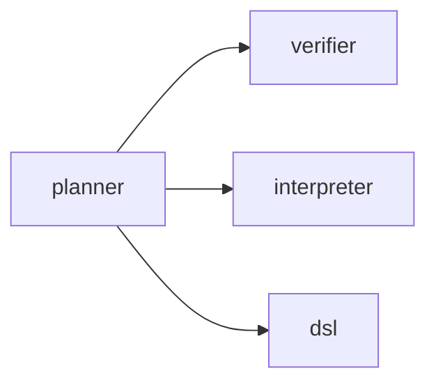

# @dvt/planner

## Component Map

## Location

- packages/@dvt/planner

## Domain

- [Planning Domain](../domain-planning.md)

## Main Responsibilities

- Plan creation and editing
- Root: [PlanAggregate](planner-aggregates.md#planaggregate) (central plan model)
- Aggregates: [StepAggregate](planner-aggregates.md#stepaggregate), [ValidationAggregate](planner-aggregates.md#validationaggregate)
- Ensures [plan structure](planner-aggregates.md#planaggregate), [dependencies](planner-aggregates.md#stepaggregate), and [constraints](planner-aggregates.md#constraints)
- Coordinates [plan lifecycle](planner-aggregates.md#responsibilities) (draft, compiled, validated)

## Explanation

@dvt/planner is responsible for the lifecycle of plans in the DVT system:

See detailed aggregates and interactions in [Planner Aggregates](planner-aggregates.md).

**Interactions:**

- [Verifier](verifier.md): Returns validation results for plans.
- [Interpreter](interpreter.md): Compiles and interprets plans for execution.
- [DSL](dsl.md): Provides domain-specific language for plan definition.

- **Root:** [PlanAggregate](planner-aggregates.md#planaggregate) — represents the central plan model, owning all steps and dependencies.
- **Aggregates:** [StepAggregate](planner-aggregates.md#stepaggregate) (individual steps), [ValidationAggregate](planner-aggregates.md#validationaggregate) (validation results).
- **Responsibilities:**
  - Create new plans and edit existing ones.
  - Manage [plan structure](planner-aggregates.md#planaggregate), [dependencies](planner-aggregates.md#stepaggregate), and [constraints](planner-aggregates.md#constraints).
  - Coordinate plan compilation and validation.
  - Transition plans through [lifecycle states](planner-aggregates.md#responsibilities) (draft, compiled, validated).

**Interactions:**

- [Verifier](verifier.md): Receives plans from planner, checks integrity, returns validation results.
- [Interpreter](interpreter.md): Receives compiled plans, interprets for execution, returns execution-ready artifacts.
- [DSL](dsl.md): Provides domain-specific language for plan definition, used by planner to enable flexible plan creation.

Planner orchestrates these interactions to ensure every plan is valid, executable, and compliant with system constraints.

## Restrictions

- Must comply with contract definitions in [PlannerContracts.v2.3.1.md](../../packages/@dvt/planner/docs/contracts/PlannerContracts.v2.3.1.md)
- Only interacts with Planning domain components

## Related Documentation

- [Component Map](../component-map.md)
- [Planning Domain](../domain-planning.md)
- [Planner Contracts](../../packages/@dvt/planner/docs/contracts/PlannerContracts.v2.3.1.md)
- [Plan Verifier](verifier.md)
- [Plan Interpreter](interpreter.md)
- [DSL](dsl.md)

## Detailed Documentation

- [DDD Structure](planner-ddd.md)
- [Functionalities](planner-functional.md)
- [Constraints & Invariants](planner-constraints.md)
- [Sequence Diagrams](planner-sequence.md)
