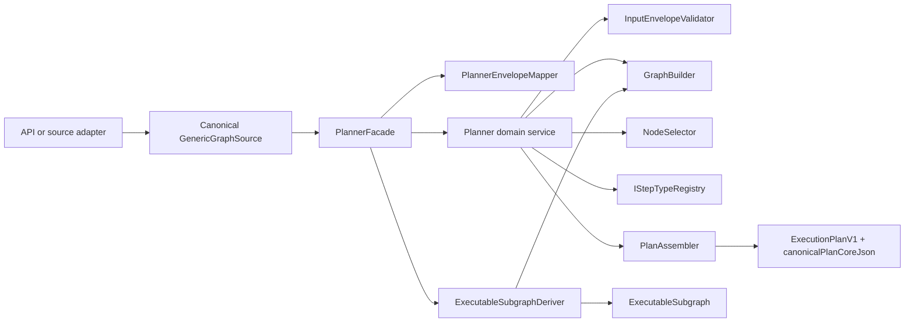

# @dvt/planner

## Canonical reading order

1. [DB-first component map](../../component-map.md)
2. [Planner contracts](../../../contracts/planner/index.md)
3. [Planner private behavior ports component](./planner-private-behavior-ports-component.md)
4. [Workspace authoring draft aggregate](./workspace-authoring-draft-aggregate.md)
5. [Executable subgraph derivation component](./executable-subgraph-derivation-component.md)
6. [ADR-0064: Substrait semantic reference](../../../adr/ADR-0064-substrait-semantic-reference-and-bounded-logical-profile.md)
7. [GenericGraphSource user manual](../../../guides/generic-graph-source-user-manual-20260404.md)
8. [Planner cycle detection technical manual](../../../guides/planner-cycle-detection-technical-manual-20260404.md)
9. [Planner cycle detection user manual](../../../guides/planner-cycle-detection-user-manual-20260404.md)
10. [MW-A2 GenericGraphSource plan](../../../planning/proposals/mandatory/runtime-and-contracts/mw-a2-generic-graph-source-plan-20260404.md)

## Scope and location

- package: `packages/@dvt/planner`
- domain: [Planning domain](../../domain-planning.md)
- public contract surfaces: `packages/@dvt/contracts/src/contracts/planner/**`

## Current truth

- public boundary: `PlannerFacade`
- public envelope: `PlannerInputEnvelopeV1`
- canonical input source: `graphSource`
- planner-owned selected-closure derivation now lives behind
  `PlannerFacade#deriveExecutableSubgraph`
- VTX2 Substrait is the sole DVT transformation authoring authority; the
  generic preview rail does not admit a DVT-specific preview profile
- source-native adaptation happens before planner admission
- source-native manifest keys, names, paths, provider coordinates, and ordinals
  are not Planner logical-identity authorities
- canonical plan artifact: `ExecutionPlan.v1.ts`
- canonical per-step retry ownership: `ExecutionStep.retryPolicy`
- plan version source: `CURRENT_EXECUTION_PLAN_VERSION`
- planner-private behavior ports live in `@dvt/planner/src/contracts`; shared
  serializable vocabulary for those ports remains in `@dvt/contracts`

## Target truth

- `graphSource` remains the canonical typed planner input boundary
- DVT transformation compilation consumes the canonical Substrait projection;
  no SQL-shaped preview profile or second planner ingress exists
- source-native refs such as DBT manifest artifacts stay outside the planner
  package and do not appear in the canonical planner ingress
- logical IDs are assigned/persisted by their owning authoring/source boundary
  and cross Planner unchanged; Planner verifies graph structure rather than
  repairing identity
- planner component pages stay summary-only and point back to canonical planner docs

## Component map

## Primary code anchors

- [PlannerFacade.ts](../../../../packages/@dvt/planner/src/application/PlannerFacade.ts)
- [ExecutableSubgraphDeriver.ts](../../../../packages/@dvt/planner/src/application/ExecutableSubgraphDeriver.ts)
- [PlannerEnvelopeMapper.ts](../../../../packages/@dvt/planner/src/application/PlannerEnvelopeMapper.ts)
- [Planner.ts](../../../../packages/@dvt/planner/src/domain/Planner.ts)
- [PlanAssembler.ts](../../../../packages/@dvt/planner/src/domain/PlanAssembler.ts)
- [ExecutionPlan.v1.ts](../../../../packages/@dvt/contracts/src/contracts/planner/ExecutionPlan.v1.ts)

## Supporting component pages

- [Functional surface](./planner-functional.md)
- [Constraints and invariants](./planner-constraints.md)
- [Structure and module map](./planner-ddd.md)
- [Build sequence](./planner-sequence.md)
- [Workspace authoring draft aggregate](./workspace-authoring-draft-aggregate.md)
- [Executable subgraph derivation component](./executable-subgraph-derivation-component.md)
- [Planner private behavior ports component](./planner-private-behavior-ports-component.md)
- [Custom policy namespace freeze user stories](./custom-policy-namespace-freeze-user-stories.md)

## Notes

- The shipped planner is service-oriented. It does not expose a mutable
  draft-edit-compile lifecycle or long-lived `PlanAggregate` API.
- If this page and another planner doc disagree, use the documents in
  "Canonical reading order" as the source of truth.
