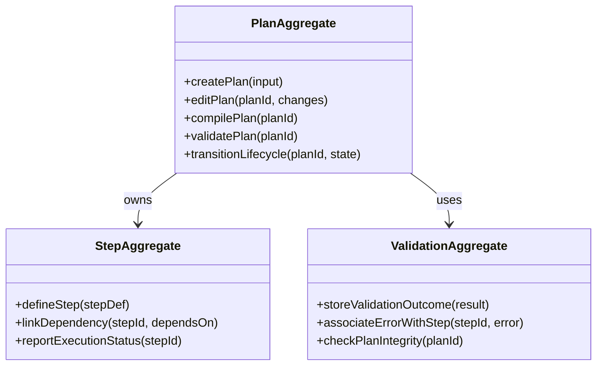

# planner DDD Structure

## DDD Diagram

## Aggregates & Entities

- **PlanAggregate**: Central plan model that owns all steps and dependencies. Manages the complete lifecycle of a plan from draft through compiled to validated, and enforces structural constraints.
- **StepAggregate**: Represents an individual step within a plan. Defines step logic, parameters, and dependency links to other steps.
- **ValidationAggregate**: Represents the validation results for a plan. Stores outcomes, associates errors and warnings with specific steps, and enables plan integrity checks.

## Domain Events

- `PlanCreated`: Emitted when a new plan is successfully created by PlanAggregate.
- `PlanEdited`: Emitted when an existing plan's structure or steps are modified.
- `PlanCompiled`: Emitted when a plan transitions to the compiled lifecycle state.
- `PlanValidated`: Emitted when the ValidationAggregate confirms a plan passes all constraints.
- `PlanValidationFailed`: Emitted when one or more constraint violations are detected during validation.
- `StepDefined`: Emitted when a new step is registered within a plan by StepAggregate.
- `DependencyLinked`: Emitted when a step-to-step dependency is established.

## Key Files

- `packages/@dvt/planner/src/domain/Planner.ts` — PlanAggregate orchestration
- `packages/@dvt/planner/src/domain/graph/GraphBuilder.ts` — Dependency graph construction
- `packages/@dvt/planner/src/domain/graph/TopoSort.ts` — Topological ordering of steps
- `packages/@dvt/planner/src/domain/PlanAssembler.ts` — Final plan assembly and hash calculation
- `packages/@dvt/planner/src/domain/stepFactory/StepFactory.ts` — StepAggregate creation and policy application
- `packages/@dvt/planner/src/domain/policies.ts` — Constraint and execution policy resolution
- `packages/@dvt/contracts/src/contracts/planner/ExecutionPlan.v2.ts` — ExecutionPlan schema
- `packages/@dvt/contracts/src/planner-input.ts` — Input envelope schema and step type definitions
