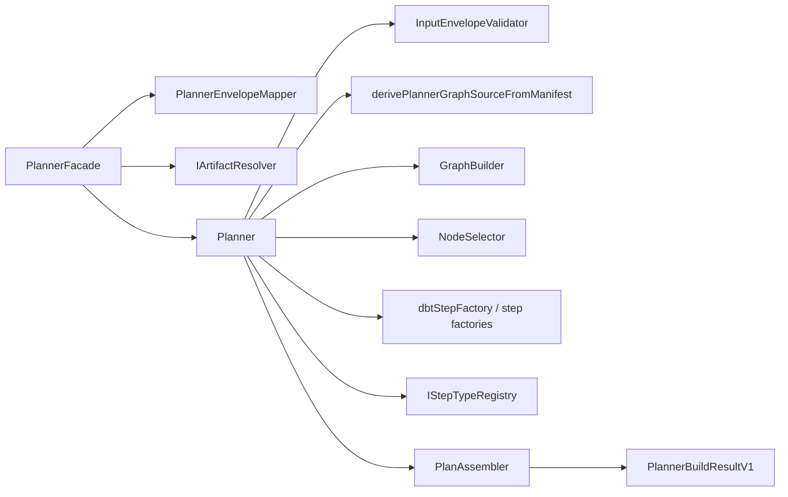

---
title: planner Structure and Module Map
status: Active
owner: Planning Domain / Architecture
last_reviewed: 2026-04-07
---

# planner Structure and Module Map

## Current structure

The shipped planner is service-oriented and contract-first. It does not expose a
mutable `PlanAggregate` API in the active runtime path.

## Module roles

- `PlannerFacade`: contract boundary and orchestration entrypoint
- `PlannerEnvelopeMapper`: converts contract-level input into planner-domain input
- `IArtifactResolver`: resolves referenced graph artifacts without widening planner ownership
- `Planner`: coordinates normalization, graph construction, selection, and assembly
- `GraphBuilder` and `NodeSelector`: derive the executable subgraph
- step factories + `IStepTypeRegistry`: keep per-kind config validation explicit
- `PlanAssembler`: builds the canonical plan artifact

## Current code anchors

- `packages/@dvt/planner/src/application/PlannerFacade.ts`
- `packages/@dvt/planner/src/application/PlannerEnvelopeMapper.ts`
- `packages/@dvt/planner/src/application/derivePlannerGraphSourceFromManifest.ts`
- `packages/@dvt/planner/src/domain/Planner.ts`
- `packages/@dvt/planner/src/domain/graph/GraphBuilder.ts`
- `packages/@dvt/planner/src/domain/PlanAssembler.ts`
- `packages/@dvt/contracts/src/contracts/planner/IExecutionPlanner.v1.ts`
- `packages/@dvt/contracts/src/contracts/planner/ExecutionPlan.v1.ts`

## Canonical references

- [Planner component entry](index.md)
- [Planner current state assessment](../../../planning/status/planner-current-state-assessment.md)
- [MW-A2 GenericGraphSource plan](../../../planning/proposals/mandatory/runtime-and-contracts/mw-a2-generic-graph-source-plan-20260404.md)
