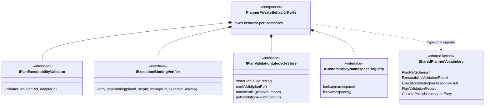
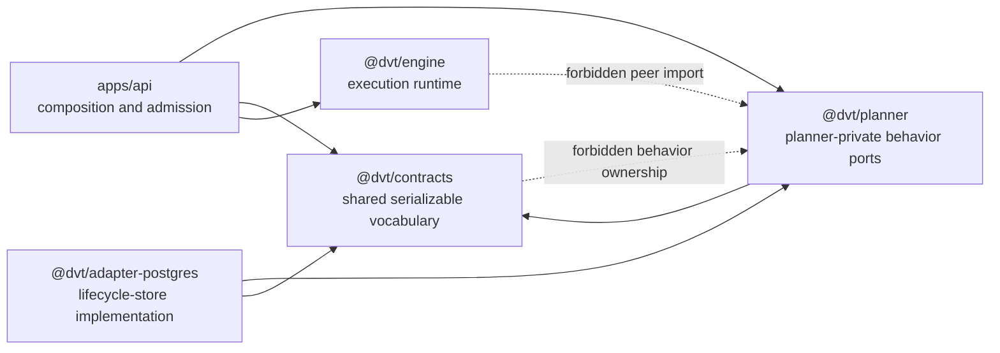
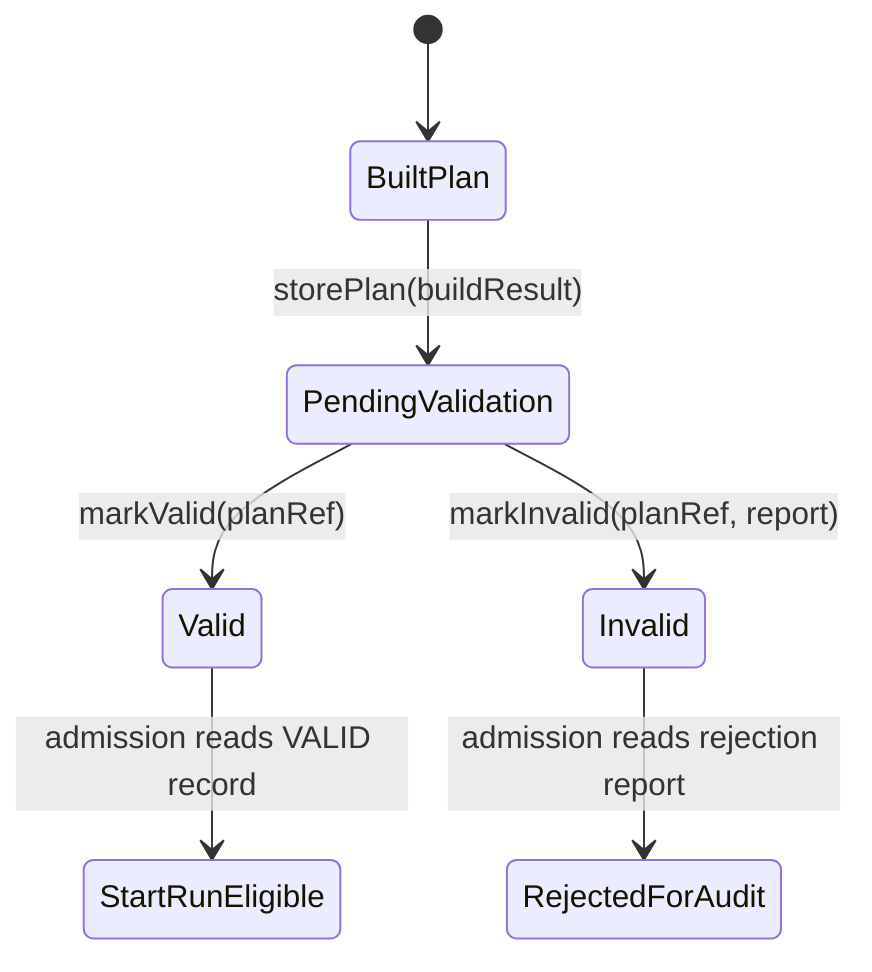
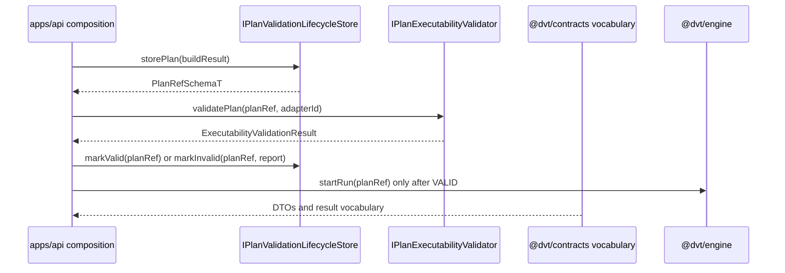

# Planner private behavior ports component

This local component guide documents the planner-owned behavior ports that were
split out of `@dvt/contracts` by `RC-G1-D`.

The normative sources remain:

- [ADR-0018 Shared Kernel Ownership Governance](../../../adr/ADR-0018_Shared_Kernel_Ownership_Governance.md)
- [ADR-0034 Bounded Context Boundaries And Communication Rules](../../../adr/ADR-0034-bounded-context-boundaries-and-communication-rules.md)
- [ADR-0035 Planner Public Contract Evolution Protocol](../../../adr/ADR-0035-planner-public-contract-evolution-protocol.md)
- [RC-G1 ownership migration plan](../../../planning/proposals/mandatory/runtime-and-contracts/contracts-domain-ownership-migration-plan-20260327.md)
- [RC-G1-D closeout](../../../planning/closeouts/20260427-rc-g1-d-planner-ownership-migration-closeout.md)

## Owned Concern

This component owns planner-private behavior-port semantics for:

- validating persisted plan executability before execution admission
- verifying compiled artifact bindings for planner-authored steps
- persisting planner validation lifecycle transitions
- resolving custom policy namespace registration for planner policy checks

It does not own shared serializable DTO vocabulary. Rejection codes, validation
results, binding records, validation records, `PlanRef`, and custom-policy DTOs
remain in `@dvt/contracts`.

## Public API

| API                                                                                       | Module                                                                 | Consumer intent                                                                                        |
| ----------------------------------------------------------------------------------------- | ---------------------------------------------------------------------- | ------------------------------------------------------------------------------------------------------ |
| `IPlanExecutabilityValidator#validatePlan(planRef, adapterId)`                            | `packages/@dvt/planner/src/contracts/PlanExecutabilityValidation.ts`   | Check whether a persisted plan reference is executable on a target adapter before start-run admission. |
| `IExecutionBindingVerifier#verifyStepBinding(planId, stepId, storageUri, expectedSha256)` | `packages/@dvt/planner/src/contracts/ExecutionBindingVerification.ts`  | Verify that a compiled artifact binding still matches the expected digest before execution uses it.    |
| `IPlanValidationLifecycleStore#storePlan(buildResult)`                                    | `packages/@dvt/planner/src/contracts/PlanValidationLifecycle.ts`       | Persist a built plan in a non-runnable validation state and return its `PlanRef`.                      |
| `IPlanValidationLifecycleStore#markValid(planRef)`                                        | `packages/@dvt/planner/src/contracts/PlanValidationLifecycle.ts`       | Transition a persisted plan to `VALID` after executability validation succeeds.                        |
| `IPlanValidationLifecycleStore#markInvalid(planRef, report)`                              | `packages/@dvt/planner/src/contracts/PlanValidationLifecycle.ts`       | Transition a persisted plan to `INVALID` with the structured rejection report.                         |
| `IPlanValidationLifecycleStore#getValidationRecord(planId)`                               | `packages/@dvt/planner/src/contracts/PlanValidationLifecycle.ts`       | Read validation state for admission and audit paths.                                                   |
| `ICustomPolicyNamespaceRegistry#lookup(namespace)`                                        | `packages/@dvt/planner/src/contracts/CustomPolicyNamespaceRegistry.ts` | Resolve the registered namespace entry used by planner policy checks.                                  |
| `ICustomPolicyNamespaceRegistry#listNamespaces()`                                         | `packages/@dvt/planner/src/contracts/CustomPolicyNamespaceRegistry.ts` | Enumerate registered custom policy namespaces without exposing registry internals.                     |

## DDD Diagram

## Component Map

## Transition Model

## Admission Sequence

## Invariants

| Invariant                                             | Where Enforced                                                                   | Description                                                                                                                |
| ----------------------------------------------------- | -------------------------------------------------------------------------------- | -------------------------------------------------------------------------------------------------------------------------- |
| Behavior ports live in planner                        | `packages/@dvt/planner/src/contracts/*.ts` and architecture tests                | The four planner-private interfaces are not defined or exported by `@dvt/contracts`.                                       |
| Shared vocabulary stays shared                        | `packages/@dvt/contracts/src/contracts/planner/*.v1.ts`                          | Serializable result, state, record, and namespace DTOs remain available to cross-context consumers.                        |
| Planner modules import contracts type-only            | `packages/@dvt/planner/test/unit/planner-private-ownership.architecture.test.ts` | Behavior-port modules may reference shared vocabulary but must not create runtime dependency edges into the shared kernel. |
| No peer-domain dependency                             | `packages/@dvt/planner/test/unit/planner-private-ownership.architecture.test.ts` | Behavior-port modules must not import engine, adapter, app, or contracts source internals.                                 |
| Root barrel exports type-only ports                   | planner root barrel plus architecture test                                       | The public planner package surface publishes interface types without runtime adapter wiring.                               |
| Adapter dependency is implementation-only             | `packages/@dvt/adapter-postgres/src/PostgresPlanStore.ts`                        | Postgres may implement the lifecycle port; it must not import planner services or aggregates.                              |
| Start-run requires validated persisted plan semantics | `IPlanValidationLifecycleStore` plus API admission flow                          | A plan moves through persisted validation state before execution eligibility is claimed.                                   |

## Consumers

- `apps/api/src/application/services/StoredPlanExecutabilityValidator.ts`
- `apps/api/src/application/services/PreviewPlanUseCase.ts`
- `apps/api/src/application/services/PlannerBackedStartRunUseCase.ts`
- `apps/api/src/modules/startRun/buildProtectedStartRunRuntime.ts`
- `packages/@dvt/adapter-postgres/src/PostgresPlanStore.ts`
- `packages/@dvt/planner/src/index.ts`
- `packages/@dvt/planner/test/unit/planner-private-ownership.architecture.test.ts`
- `packages/@dvt/contracts/test/planner-private-ownership.architecture.test.ts`

## Semantic Architecture Guard

`packages/@dvt/planner/test/unit/planner-private-ownership.architecture.test.ts`
validates more than barrel thinness:

- every behavior-port module starts with an `Owned concern` docblock
- the root `@dvt/planner` barrel exports each behavior port with `export type`
- every module references the expected shared vocabulary symbols
- shared vocabulary is imported from `@dvt/contracts` with `import type`
- modules do not export DTO vocabulary such as `const`, `enum`, or `type`
- modules do not import peer domains, concrete adapters, apps, or
  `@dvt/contracts/src` internals

## Extension Rules

- Add new planner-private behavior ports only under `@dvt/planner`.
- Add new shared result or DTO vocabulary only under `@dvt/contracts` when it is
  serializable and cross-context.
- Update this component guide, the semantic architecture test, and ARC evidence
  in the same slice when a port is added, removed, or semantically changed.
- Do not create compatibility aliases in `@dvt/contracts` for planner-private
  behavior ports.
- Do not use adapter or application imports from the planner behavior-port
  modules.
