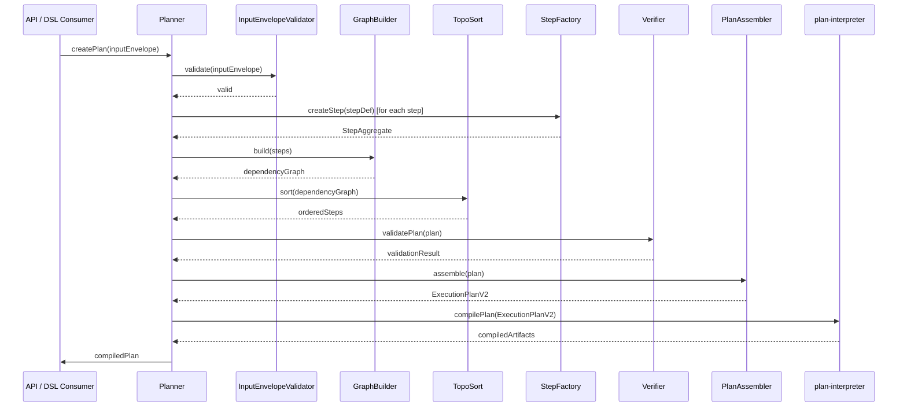

# planner Sequence

## Main Flow: Plan Creation, Validation, and Compilation

## Global Flow Position

`@dvt/planner` is the entry point of the Planning Domain in the DVT system. It is invoked by the API layer or DSL consumers to create and compile plans. It drives the entire planning pipeline: validating input, building the dependency graph, ordering steps, running constraint checks via the Verifier, assembling the final plan, and handing it off to `@dvt/plan-interpreter` for compilation into engine-executable artifacts. The interpreter delivers those artifacts to `@dvt/engine`, which takes over for workflow orchestration.

## Key Files

- `packages/@dvt/planner/src/domain/Planner.ts` — Main orchestration entry point
- `packages/@dvt/planner/src/domain/graph/GraphBuilder.ts` — Dependency graph construction
- `packages/@dvt/planner/src/domain/graph/TopoSort.ts` — Topological ordering
- `packages/@dvt/planner/src/domain/PlanAssembler.ts` — Final plan assembly
- `packages/@dvt/planner/src/domain/stepFactory/StepFactory.ts` — Step instantiation
- `packages/@dvt/planner/src/domain/InputEnvelopeValidator.ts` — Input validation
