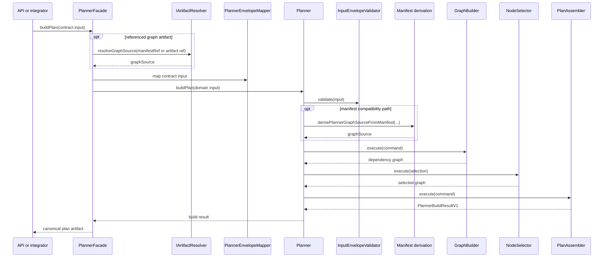

# planner Build Sequence

## Current `buildPlan()` flow

## Boundary note

Planner stops at canonical plan construction. Runtime compatibility validation,
stored-plan lifecycle, and execution dispatch belong to API, verifier, and
engine surfaces, not to the planner package itself.

## Current code anchors

- `packages/@dvt/planner/src/application/PlannerFacade.ts`
- `packages/@dvt/planner/src/application/PlannerEnvelopeMapper.ts`
- `packages/@dvt/planner/src/application/derivePlannerGraphSourceFromManifest.ts`
- `packages/@dvt/planner/src/domain/Planner.ts`
- `packages/@dvt/planner/src/domain/graph/GraphBuilder.ts`
- `packages/@dvt/planner/src/domain/NodeSelector.ts`
- `packages/@dvt/planner/src/domain/PlanAssembler.ts`

## Canonical references

- [Planner component entry](index.md)
- [Planner contracts](../../../contracts/planner/index.md)
- [Planner current state assessment](../../../planning/status/planner-current-state-assessment-20260320.md)
