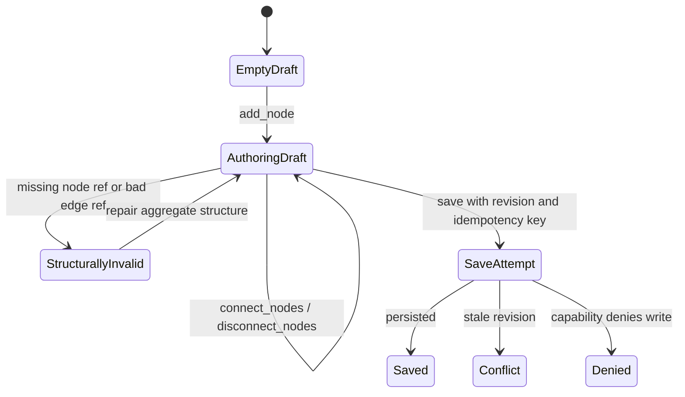
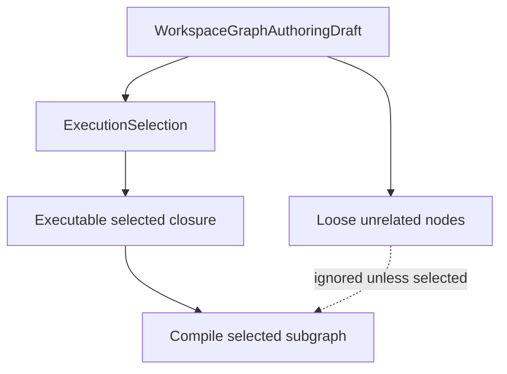

# Workspace authoring draft aggregate

This local component guide describes the graph-first editable draft aggregate
used by Canvas authoring and protected workspace draft persistence.

The normative contract sources remain:

- `packages/@dvt/contracts/src/contracts/planner/WorkspaceGraphAuthoringDraft.v1.ts`
- `packages/@dvt/contracts/src/contracts/planner/WorkspaceGraphAuthoringCommand.v1.ts`
- `packages/@dvt/contracts/src/contracts/planner/WorkspaceGraphDraft.v1.ts`
- [Execution selection and executable subgraph v1](../../../contracts/planner/execution-selection-and-executable-subgraph-v1.md)
- [Workspace graph draft persistence v1](../../../contracts/planner/workspace-graph-draft-persistence-v1.md)

## Owned concern

The component owns editable workspace graph truth:

- visible node membership
- node positions
- semantic node records
- semantic edge records
- protected draft persistence envelopes

It does not own HTTP transport, auth, audit storage, compare-and-swap storage,
React Flow viewport state, compile projection, or runtime execution.

## Erosion path to prevent

Do not let the protected API become a shadow engine.

The forbidden drift is:

1. UI starts as a generic API client.
2. API compiles, stores, validates, and admits from one path.
3. API adds run policy decisions.
4. API adds retry and recovery semantics.
5. API becomes a shadow engine.

The component boundary keeps these concerns apart: UI handles authoring
interaction, API handles protected commands, Planner handles compile projection,
and Engine/runtime handles execution lifecycle.

## Public API

- `WorkspaceGraphAuthoringDraft`
  Editable aggregate root persisted as protected draft payload.
- `WorkspaceGraphAuthoringCommand`
  Serializable pure aggregate mutation vocabulary.
- `WorkspaceGraphDraftSaveRequest`
  Protected write command with scope, schema version, expected revision,
  idempotency key, and authoring draft.
- `WorkspaceGraphDraftReadResponse`
  Protected read outcome with capability, audit reference, format metadata, and
  authoring draft record.
- `WorkspaceGraphDraftSaveResponse`
  Protected write outcome: `saved`, `conflict`, or `denied`.

## Invariants

- `nodeIds` are unique.
- `nodePositions` exist for exactly the visible `nodeIds`.
- visible node ids reference declared semantic nodes.
- semantic node ids are unique.
- semantic edge ids are unique.
- semantic edges reference declared semantic nodes.
- zero nodes, one node, disconnected graphs, and partially connected graphs are
  valid authoring states.
- compile invariants do not belong to the persisted aggregate.
- `DesignGraphDraft` is derived for preview/run only; it is not the editable
  persistence payload.

## User stories

- As a data author, I can save the first node before the graph is compile-ready.
- As a data author, I can keep disconnected draft work on the canvas without
  blocking another selected executable node.
- As an operator, I can run/preview an explicit selected node or subgraph rather
  than the whole draft.
- As an API caller, I receive typed conflict, denied, and format-error outcomes
  instead of silent fallback.
- As a frontend maintainer, I can project authoring truth into React Flow state
  without making the viewport the aggregate authority.

## Transitions

Save success means the editable draft is persisted. It does not mean the whole
draft is compile-ready.

## Component map

```mermaid
flowchart LR
  Web["apps/web Canvas authoring"] --> WebPort["IWorkspaceGraphDraftAuthoringPort"]
  WebPort --> Api["apps/api protected draft routes"]
  Api --> App["Get/SaveWorkspaceGraphDraftUseCase"]
  App --> Boundary["WorkspaceGraphDraft.v1 envelope"]
  Boundary --> Root["WorkspaceGraphAuthoringDraft root"]
  Root --> Projection["selected-subgraph projection"]
  Projection --> Design["DesignGraphDraft"]
  Design --> PreviewRun["Preview / Run"]
```

## Execution selection rule

An unrelated loose node does not block running a selected executable SQL node.
Selecting the loose node directly requires that selected node and its dependency
closure to be executable.

The dedicated execution-selection seam now lives in the companion local guide:
[Execution selection component](./execution-selection-component.md).

The dedicated planner-owned selected-closure derivation seam now lives in:
[Executable subgraph derivation component](./executable-subgraph-derivation-component.md).

## Consumers

- `packages/@dvt/contracts/src/validation/planner.ts`
- `apps/api/src/application/ports/workspaceGraphDraft.ts`
- `apps/api/src/application/services/getWorkspaceGraphDraftUseCase.ts`
- `apps/api/src/application/services/saveWorkspaceGraphDraftUseCase.ts`
- `apps/web/src/app/ports/workspaceGraphDraftAuthoring.ts`
- `apps/web/src/app/services/workspace/workspaceGraphDraftProjection.ts`
- `apps/web/src/app/views/canvas/canvasDraftAuthoring.ts`
- `apps/web/src/app/views/canvas/canvasDraftRepository.ts`
- `packages/@dvt/contracts/src/contracts/planner/ExecutionSelection.v1.ts`
- `packages/@dvt/contracts/src/contracts/planner/ExecutableSubgraph.v1.ts`

## Extension rules

- Add authoring fields to `WorkspaceGraphAuthoringDraft.v1.ts` first.
- Keep persistence envelope fields in `WorkspaceGraphDraft.v1.ts`.
- Keep compile-only fields in compile projection contracts.
- Keep preview/run selection contracts in the execution-selection component.
- Add semantic contract tests for every new aggregate invariant.
- Do not add compatibility paths accepting `DesignGraphDraft` as a save payload.
