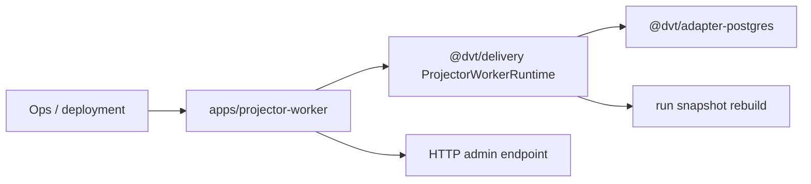

# dvt-projector-worker

`dvt-projector-worker` is the standalone read-model projector composition root
under `apps/projector-worker`.

It runs the shared projector runtime in its own process, exposes a lightweight
admin endpoint, and keeps snapshot rebuild work downstream from the API and
engine composition roots.

## Current Responsibilities

- bootstrap the projector worker process and admin HTTP endpoint;
- migrate the Postgres-backed state-store boundary before starting work;
- run `ProjectorWorkerRuntime` against stale snapshot backlog;
- report projector lag for operators.

## Interface Map

## Code Anchors

- [server.ts](../../../../apps/projector-worker/src/server.ts)
- [env.ts](../../../../apps/projector-worker/src/env.ts)
- [ProjectorWorkerRuntime.ts](../../../../packages/@dvt/delivery/src/application/ProjectorWorkerRuntime.ts)
- [PostgresStateStoreAdapter.ts](../../../../packages/@dvt/adapter-postgres/src/PostgresStateStoreAdapter.ts)

## Current Posture

This is active product runtime code. The main work left is around delivery-side
hardening and operations, not around inventing projector ownership.

## Planned Delta

- keep read-model rebuild explicitly downstream from run lifecycle ownership;
- preserve the simple lag endpoint as the worker runtime grows more operational
  controls;
- keep projector policy in delivery/runtime code rather than drifting back into
  API or engine composition.

## Related Pages

- [@dvt/delivery](../delivery/index.md)
- [dvt-outbox-worker](../outbox-worker/index.md)
- [Delivery Domain](../../domain-delivery.md)
- [DVT Component Map](../../component-map.md)
