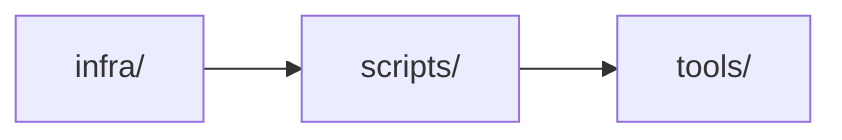

# scripts/

## Component Map

## Location

- scripts/

## Domain

- [Infra Domain](../domain-infra.md)

## Main Responsibilities

- Scripts, CI/CD, tooling
- Root: ScriptAggregate (central script model)
- Aggregates: ValidationAggregate
- Ensures CI/CD, validation, and tooling support

## Explanation

scripts/ is responsible for CI/CD, validation, and tooling:

- **Root:** [ScriptAggregate](scripts.md#scriptaggregate) — represents the central script model, owning CI/CD and validation logic.
- **Aggregates:** [ValidationAggregate](scripts.md#validationaggregate).
- **Responsibilities:**
  - Provide scripts for CI/CD and validation.
  - Support infra and tooling operations.
  - Report script status to infra domain.

**Interactions:**

- **[Infra](infra.md):** Receives scripts for environment provisioning.
- **[Tools](tools.md):** Uses scripts for development and operations.

Scripts coordinates these interactions to ensure CI/CD, validation, and tooling support.

## ScriptAggregate

Represents the central script model, owning CI/CD and validation logic. Responsible for:

- Managing CI/CD scripts
- Managing validation scripts
- Reporting script status

## ValidationAggregate

Represents validation management for scripts. Responsible for:

- Storing validation scripts
- Managing validation operations
- Reporting validation status

## Restrictions

- Must comply with CI/CD standards and infrastructure requirements
- Only interacts with Infra domain, infra/, and tools

## Related Documentation

- [Component Map](../component-map.md)
- [Infra Domain](../domain-infra.md)

## Detailed Documentation

- [DDD Structure](scripts-ddd.md)
- [Functionalities](scripts-functional.md)
- [Constraints & Invariants](scripts-constraints.md)
- [Sequence Diagrams](scripts-sequence.md)
