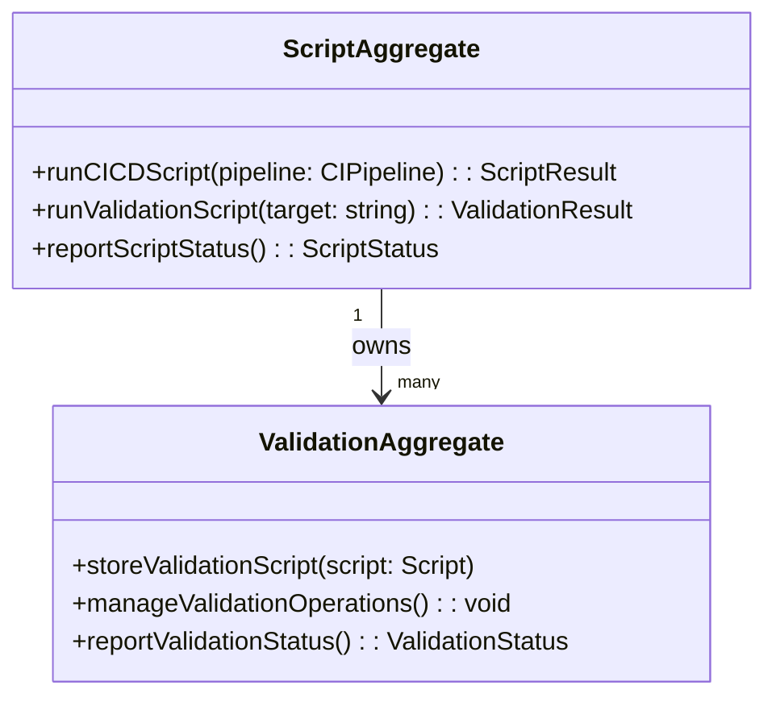

# Scripts DDD Structure

## DDD Diagram

## Aggregates & Entities

- **ScriptAggregate**: The central script model and aggregate root for the `scripts/` directory. Owns all CI/CD pipeline scripts and validation logic, coordinating their execution and reporting status to the Infra domain.
- **ValidationAggregate**: Represents a managed set of validation scripts. Stores individual validation scripts, manages their execution order and dependencies, and reports validation status back to ScriptAggregate.

## Domain Events

- `CICDScriptExecuted`: Emitted when a CI/CD pipeline script completes execution, recording the outcome (success or failure).
- `ValidationScriptPassed`: Emitted when a validation script run completes without errors.
- `ValidationScriptFailed`: Emitted when a validation script run encounters errors, triggering downstream failure handling in the CI pipeline.
- `ScriptStatusReported`: Emitted when ScriptAggregate reports current script status to the Infra domain.

## Key Files

- `scripts/ci/`
- `scripts/validate/`
- `scripts/lib/`
