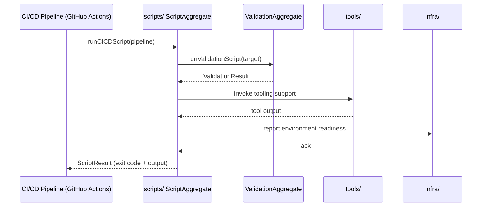

# Scripts Sequence

## Main Flow: CI/CD Pipeline Execution

## Global Flow Position

`scripts/` sits in the Infra domain as the automation backbone for CI/CD and validation workflows. It is invoked by the CI/CD pipeline (e.g., GitHub Actions workflows in `.github/`) during build, test, lint, and deploy phases. It calls into `tools/` for developer tooling operations and reports environment readiness to `infra/`. It has no runtime relationship with application-layer packages such as `@dvt/engine` or `@dvt/contracts` — it operates purely at the infrastructure and automation layer. The `infra/` layer provisions environments based on script-reported outcomes.

## Key Files

- `scripts/ci/`
- `scripts/validate/`
- `scripts/lib/`
- `.github/workflows/`
