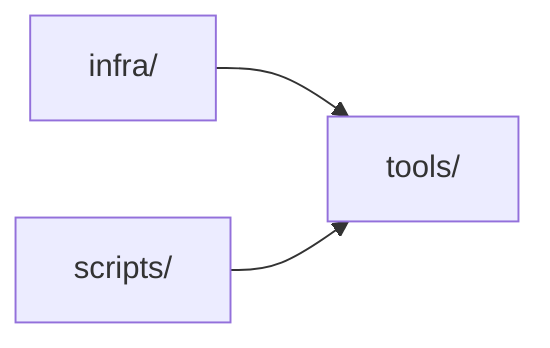

# tools/

## Component Map

## Location

- tools/

## Domain

- [Infra Domain](../domain-infra.md)

## Main Responsibilities

- Tooling, CI/CD
- Root: ToolAggregate (central tool model)
- Aggregates: OperationAggregate
- Ensures development, operations, and CI/CD support

## Explanation

tools/ is responsible for development, operations, and CI/CD support:

- **Root:** [ToolAggregate](tools.md#toolaggregate) — represents the central tool model, owning development and operations logic.
- **Aggregates:** [OperationAggregate](tools.md#operationaggregate).
- **Responsibilities:**
  - Provide tools for development and operations.
  - Support CI/CD and infra operations.
  - Report tool status to infra domain.

**Interactions:**

- **[Infra](infra.md):** Receives tools for environment provisioning.
- **[Scripts](scripts.md):** Uses tools for CI/CD and validation.

Tools coordinates these interactions to ensure development, operations, and CI/CD support.

## ToolAggregate

Represents the central tool model, owning development and operations logic. Responsible for:

- Managing development tools
- Managing operations tools
- Reporting tool status

## OperationAggregate

Represents operation management for tools. Responsible for:

- Storing operation tools
- Managing operation logic
- Reporting operation status

## Restrictions

- Must comply with CI/CD standards and infrastructure requirements
- Only interacts with Infra domain, infra/, and scripts/

## Related Documentation

- [Component Map](../component-map.md)
- [Infra Domain](../domain-infra.md)
