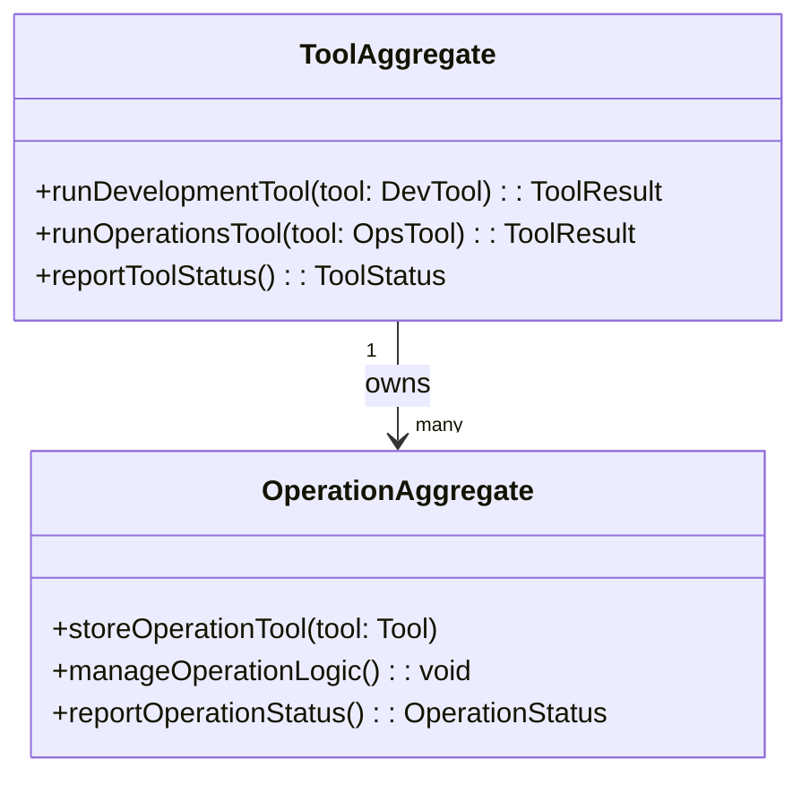

# Tools DDD Structure

## DDD Diagram

## Aggregates & Entities

- **ToolAggregate**: The central tool model and aggregate root for the `tools/` directory. Owns all development and operations tooling, coordinating tool execution and reporting status to the Infra domain.
- **OperationAggregate**: Represents a managed set of operational tools. Stores tool definitions, manages execution logic, and reports operation status back to ToolAggregate.

## Domain Events

- `DevelopmentToolExecuted`: Emitted when a developer-facing tool (e.g., code generator, local setup helper) completes execution.
- `OperationToolExecuted`: Emitted when an operations tool (e.g., database migration runner, environment inspector) completes execution.
- `ToolStatusReported`: Emitted when ToolAggregate reports current tool status to the Infra domain.

## Key Files

- `tools/dev/`
- `tools/ops/`
- `tools/lib/`
