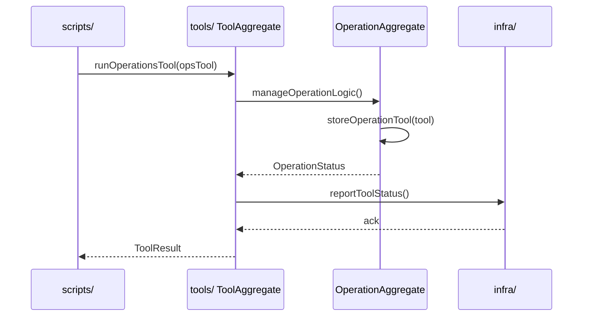

# Tools Sequence

## Main Flow: Operations Tool Execution

## Global Flow Position

`tools/` sits in the Infra domain as the runtime tooling layer for development and operations workflows. It is consumed by `scripts/` during CI/CD pipeline execution and by `infra/` during environment provisioning. It does not call application-layer packages directly — it operates at the infrastructure level, providing utilities that support the build, deploy, and operations lifecycle. Developer-facing tools support local workspace setup, while operations tools support production and staging environment management. The `tools/` layer is a terminal consumer in the Infra domain; nothing downstream of `tools/` feeds back into it.

## Key Files

- `tools/dev/`
- `tools/ops/`
- `tools/lib/`
