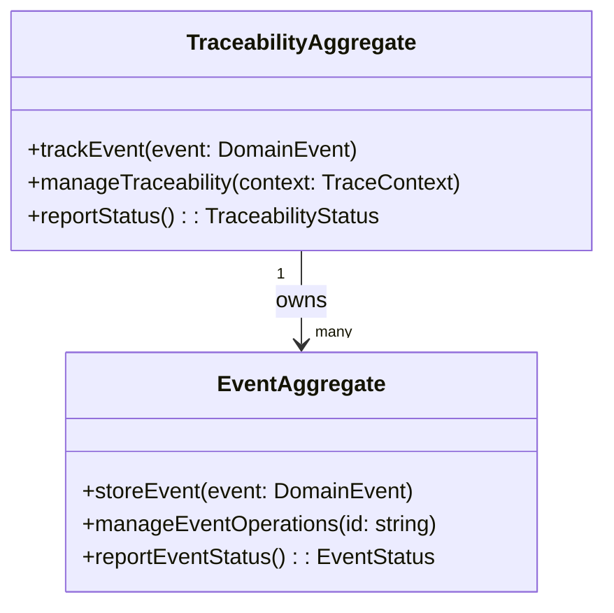

# Traceability Service DDD Structure

## DDD Diagram

## Aggregates & Entities

- **TraceabilityAggregate**: The central traceability model and aggregate root. Owns all event tracking state and coordinates traceability operations across the shared boundary domain.
- **EventAggregate**: Represents an individual tracked event. Stores event data, associates events with workflow steps, and reports event status back to the TraceabilityAggregate.

## Domain Events

- `EventTracked`: Emitted when a new domain event is successfully captured and stored by the EventAggregate.
- `TraceabilityStatusReported`: Emitted when the TraceabilityAggregate reports traceability status to the shared boundary.
- `TraceabilityOperationManaged`: Emitted when a traceability operation is executed and its outcome is recorded.

## Key Files

- `packages/@dvt/traceability-service/src/domain/TraceabilityAggregate.ts`
- `packages/@dvt/traceability-service/src/domain/EventAggregate.ts`
- `packages/@dvt/traceability-service/src/domain/types.ts`
