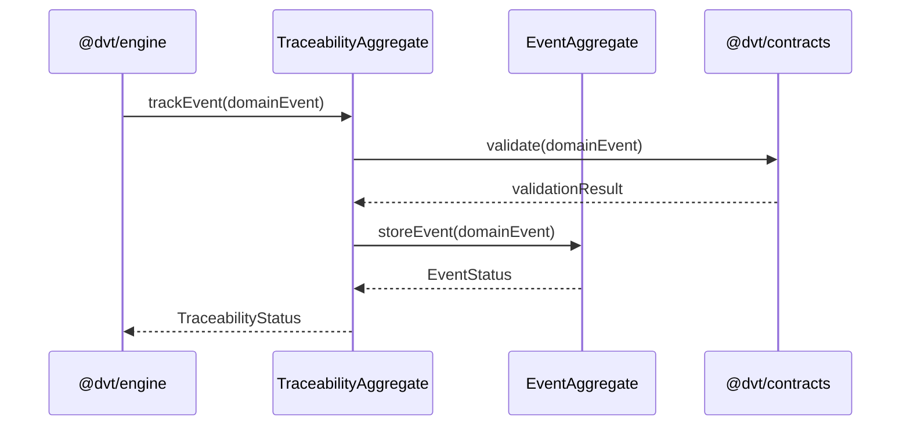

# Traceability Service Sequence

## Main Flow: trackEvent

## Global Flow Position

`@dvt/traceability-service` sits at the shared boundary layer of the DVT system. It is called by `@dvt/engine` during workflow execution to record every significant step and state transition. It validates incoming events against `@dvt/contracts` before persisting them. It does not initiate calls to the Planning, Execution, or UI domains — it is a passive receiver that provides traceability guarantees to the rest of the system. The lineage worker (`apps/lineage-worker`) and projector worker (`apps/projector-worker`) may query traceability data to build read models and emit OpenLineage events downstream.

## Key Files

- `packages/@dvt/traceability-service/src/domain/TraceabilityAggregate.ts`
- `packages/@dvt/traceability-service/src/domain/EventAggregate.ts`
- `packages/@dvt/traceability-service/src/application/TraceabilityService.ts`
- `packages/@dvt/contracts/src/engine/IRunStateStore.v1.ts`
