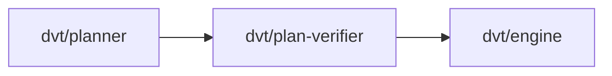

# @dvt/plan-verifier

## Component Map

## Location

- packages/@dvt/planner

## Domain

- [Planning Domain](../domain-planning.md)

## Main Responsibilities

- Plan integrity validation
- Root: VerifierAggregate (central validation model)
- Aggregates: ErrorAggregate, WarningAggregate
- Ensures plan integrity, error/warning tracking

## Explanation

@dvt/plan-verifier is responsible for validating plan integrity:

- **Root:** [VerifierAggregate](verifier.md#verifieraggregate) — represents the central validation model, owning all validation results.
- **Aggregates:** [ErrorAggregate](verifier.md#erroraggregate), [WarningAggregate](verifier.md#warningaggregate).
- **Responsibilities:**
  - Validate plan structure and constraints.
  - Track errors and warnings.
  - Return validation results to planner.

**Interactions:**

- **[Planner](planner.md):** Receives plans for validation.
- **[Engine](engine.md):** Ensures only valid plans are executed.

Verifier coordinates these interactions to ensure plan integrity and traceability.

## VerifierAggregate

Represents the central validation model, owning all validation results. Responsible for:

- Managing validation state
- Tracking errors and warnings
- Returning results to planner

**Validation schema:** See [VerifierAggregate types](../../packages/@dvt/planner/src/domain/types.ts)
**Validation contract:** See [PlannerContracts.v2.3.1.md](../../packages/@dvt/planner/docs/contracts/PlannerContracts.v2.3.1.md)

## ErrorAggregate

Represents error tracking for plan validation. Responsible for:

- Storing validation errors
- Associating errors with plan steps
- Reporting error status

**Error schema:** See [ErrorAggregate types](../../packages/@dvt/planner/src/domain/types.ts)

## WarningAggregate

Represents warning tracking for plan validation. Responsible for:

- Storing validation warnings
- Associating warnings with plan steps
- Reporting warning status

**Warning schema:** See [WarningAggregate types](../../packages/@dvt/planner/src/domain/types.ts)

## Restrictions

- Must comply with contract definitions in [PlannerContracts.v2.3.1.md](../../packages/@dvt/planner/docs/contracts/PlannerContracts.v2.3.1.md)
- Only interacts with Planning and Execution domain components

## Related Documentation

- [Component Map](../component-map.md)
- [Planning Domain](../domain-planning.md)
- [Planner Contracts](../../packages/@dvt/planner/docs/contracts/PlannerContracts.v2.3.1.md)

## Detailed Documentation

- [DDD Structure](verifier-ddd.md)
- [Functionalities](verifier-functional.md)
- [Constraints & Invariants](verifier-constraints.md)
- [Sequence Diagrams](verifier-sequence.md)
