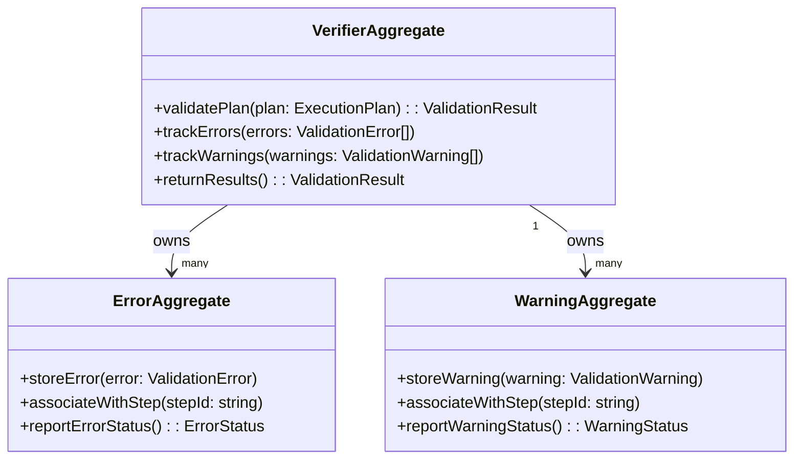

# Plan Verifier DDD Structure

## DDD Diagram

## Aggregates & Entities

- **VerifierAggregate**: The central validation model and aggregate root. Owns all validation results and coordinates error/warning tracking for a given plan validation pass.
- **ErrorAggregate**: Represents a set of validation errors for a plan. Stores error records, associates them with specific plan steps, and reports error status to the root.
- **WarningAggregate**: Represents a set of validation warnings for a plan. Stores warning records, associates them with specific plan steps, and reports warning status to the root.

## Domain Events

- `PlanValidated`: Emitted when a plan passes all validation checks and is cleared for execution by the engine.
- `PlanValidationFailed`: Emitted when one or more errors are found during plan validation, preventing engine execution.
- `ValidationWarningRaised`: Emitted when a non-blocking warning is recorded during validation, allowing the plan to proceed with caveats.

## Key Files

- `packages/@dvt/planner/src/domain/VerifierAggregate.ts`
- `packages/@dvt/planner/src/domain/ErrorAggregate.ts`
- `packages/@dvt/planner/src/domain/WarningAggregate.ts`
- `packages/@dvt/planner/src/domain/types.ts`
