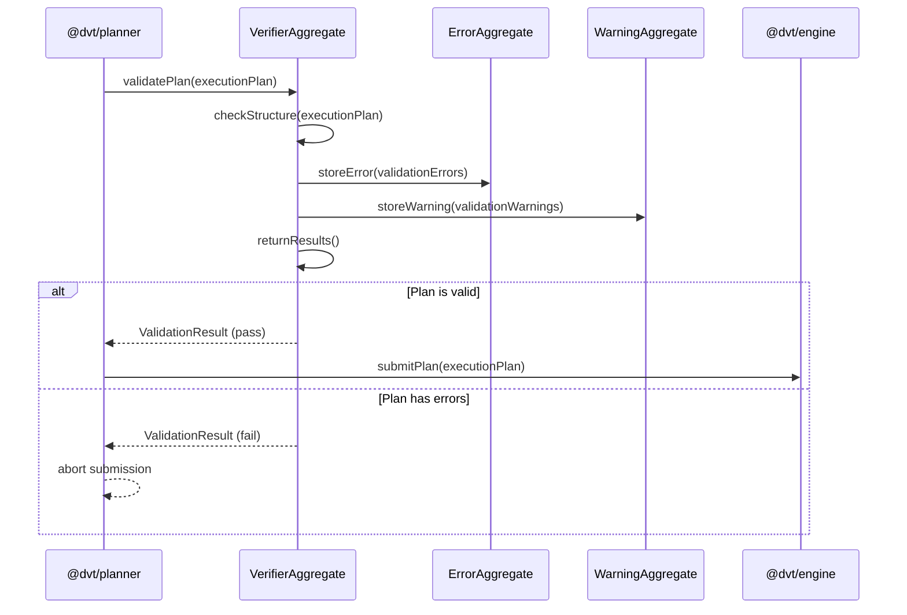

# Plan Verifier Sequence

## Main Flow: validatePlan

## Global Flow Position

`@dvt/plan-verifier` (located within `@dvt/planner`) sits between the Planner and the Engine in the Planning Domain. The planner constructs an ExecutionPlan and passes it to the verifier before any engine interaction. The verifier acts as a hard gate: only plans that receive a passing ValidationResult are forwarded to `@dvt/engine` for execution. The verifier does not call the engine itself — it returns results to the planner, which makes the final forwarding decision. No UI, Infra, or Shared Boundary component calls the verifier directly.

## Key Files

- `packages/@dvt/planner/src/domain/VerifierAggregate.ts`
- `packages/@dvt/planner/src/domain/ErrorAggregate.ts`
- `packages/@dvt/planner/src/domain/WarningAggregate.ts`
- `packages/@dvt/planner/src/domain/types.ts`
