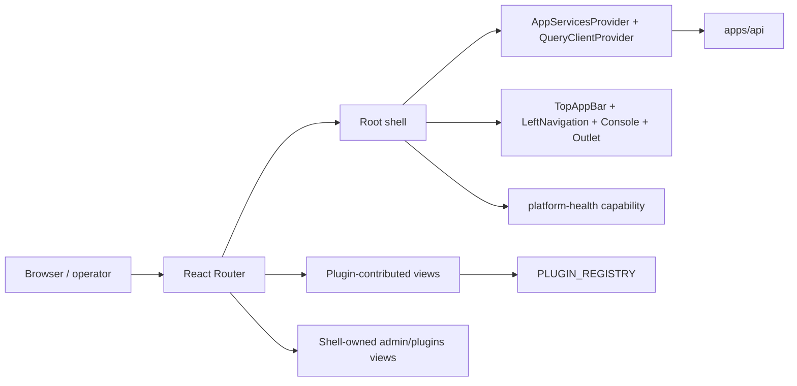

# apps/web

`apps/web` is the deployable browser application for DVT.

The shell composes plugin-contributed routes for most product views and keeps
only a small set of shell-owned routes directly in the router.

## Current Responsibilities

- bootstrap the browser application and router;
- host the persistent shell;
- render plugin-contributed Canvas, Runs, Lineage, Code, Diff, and Artifacts views;
- render shell-owned Plugins and Admin routes;
- provide health visibility and shell-level UX context;
- compose client services, capabilities, and plugin-contributed views.

## Current Route Inventory

| Route                   | View                                 |
| ----------------------- | ------------------------------------ |
| `/canvas`               | graph workbench                      |
| `/runs`, `/runs/:runId` | run-monitoring workbench             |
| `/lineage`              | dependency and impact analysis       |
| `/code`                 | code and compiled-source inspection  |
| `/diff`                 | review and diff surface              |
| `/artifacts`            | artifact browser and manifest import |
| `/plugins`              | plugin management shell page         |
| `/admin`                | admin shell page                     |

## Current Shell Topology

## Current Code Anchors

- [main.tsx](../../../../apps/web/src/main.tsx)
- [App.tsx](../../../../apps/web/src/app/App.tsx)
- [Root.tsx](../../../../apps/web/src/app/Root.tsx)
- [routes.ts](../../../../apps/web/src/app/routes.ts)
- [registry.ts](../../../../apps/web/src/app/plugins/registry.ts)
- [Canvas.tsx](../../../../apps/web/src/app/views/Canvas.tsx)
- [RunsView.tsx](../../../../apps/web/src/app/views/RunsView.tsx)

## Library Direction

- [React Flow](https://reactflow.dev/) for graph interaction;
- TanStack Query for server-state and polling;
- Zustand for local shell and view state;
- [Radix Primitives](https://www.radix-ui.com/primitives) and
  [shadcn/ui](https://ui.shadcn.com/) for accessible UI primitives;
- [TanStack Table](https://tanstack.com/table/latest) for future dense grids;
- [Monaco Editor](https://github.com/microsoft/monaco-editor) for future code
  and diff panes;
- [xterm.js](https://xtermjs.org/) for any future real console surface.

## Related Pages

- [Frontend Architecture](../../frontend/index.md)
- [Main Workspace Views And UX](../../frontend/main-workspace-views-and-ux.md)
- [UX Implementation Guide](../../frontend/ux-implementation-guide.md)
