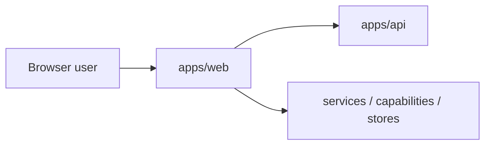

# apps/web

`apps/web` is the deployable browser application shell for DVT.

It owns app bootstrap, routing, shell layout, client-side data flow, and the
operator-facing experience that consumes the backend runtime surface.

## Current Responsibilities

- bootstrap the browser app and router;
- render the top-level shell, routes, and major product views;
- consume backend health and runtime data through client services;
- isolate frontend composition from backend orchestration concerns.

## Interface Map

## Code Anchors

- [main.tsx](../../../../apps/web/src/main.tsx)
- [App.tsx](../../../../apps/web/src/app/App.tsx)
- [routes.ts](../../../../apps/web/src/app/routes.ts)
- [TopAppBar.tsx](../../../../apps/web/src/app/components/TopAppBar.tsx)
- [RunsView.tsx](../../../../apps/web/src/app/views/RunsView.tsx)

## Current Posture

The application shell is real and partially backend-backed. Local test files
exist under `apps/web/src/**`, but the workspace still lacks a declared
frontend `test` script, so the current governed lane is still `typecheck` plus
`build`.

## Planned Delta

- `F-01`: simplify the shell and free up canvas space;
- `F-03`: wire platform health into the visible shell;
- `F-04`: isolate mock-versus-API data sources;
- `MVP-E1`: align the shell with the backend contract that exists today.

## Historical Deep Dives

- [DDD Structure](web-app-ddd.md)
- [Functionalities](web-app-functional.md)
- [Constraints and invariants](web-app-constraints.md)
- [Sequence diagrams](web-app-sequence.md)
