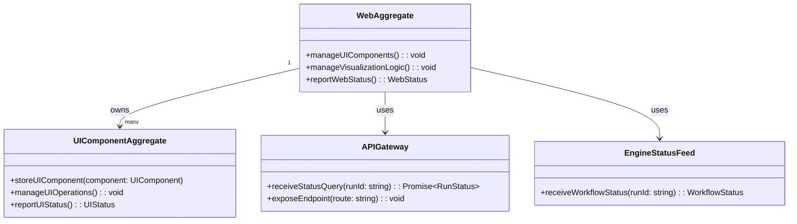

# Web App DDD Structure

## DDD Diagram

## Aggregates & Entities

- **WebAggregate**: The central web model and aggregate root for `apps/web`. Owns all UI components, visualization logic, and coordinates interactions with the API and engine.
- **UIComponentAggregate**: Represents individual managed UI components within the application. Stores component state, manages UI operations, and reports status to WebAggregate.
- **APIGateway**: Boundary object that mediates communication between the web application and `apps/api`, receiving status queries and routing user-initiated requests.
- **EngineStatusFeed**: Boundary object that surfaces workflow execution status from `@dvt/engine` into the application for display.

## Domain Events

- `UIComponentRendered`: Emitted when a UIComponentAggregate successfully renders its view to the browser.
- `RunStatusDisplayed`: Emitted when the WebAggregate successfully retrieves and displays a run's status for the user.
- `UserActionDispatched`: Emitted when a user interaction is captured and forwarded to the API layer.

## Key Files

- `apps/web/src/domain/WebAggregate.ts`
- `apps/web/src/domain/UIComponentAggregate.ts`
- `apps/web/src/gateways/APIGateway.ts`
- `apps/web/src/index.ts`
