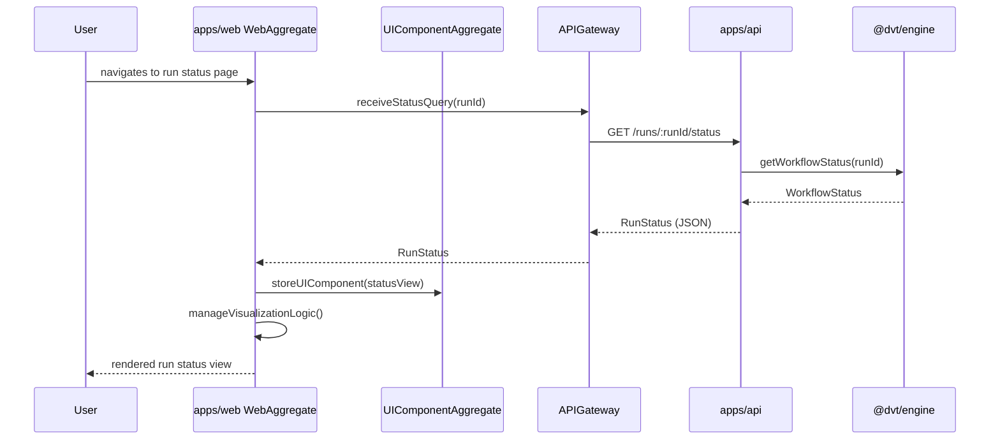

# Web App Sequence

## Main Flow: Display Run Status

## Global Flow Position

`apps/web` is the end-user-facing application in the DVT system. It sits at the top of the call chain for all user-initiated interactions. It depends on `apps/api` for all data and on `@dvt/engine` (via the EngineStatusFeed) for live workflow state. It is called by nothing else in the system — it is the entry point for human operators and monitoring consumers. The `@dvt/web` package provides the shared component library that `apps/web` consumes. No Planning, Execution, Infra, or Shared Boundary domain component calls `apps/web`.

## Key Files

- `apps/web/src/domain/WebAggregate.ts`
- `apps/web/src/domain/UIComponentAggregate.ts`
- `apps/web/src/gateways/APIGateway.ts`
- `apps/web/src/gateways/EngineStatusFeed.ts`
- `apps/web/src/index.ts`
