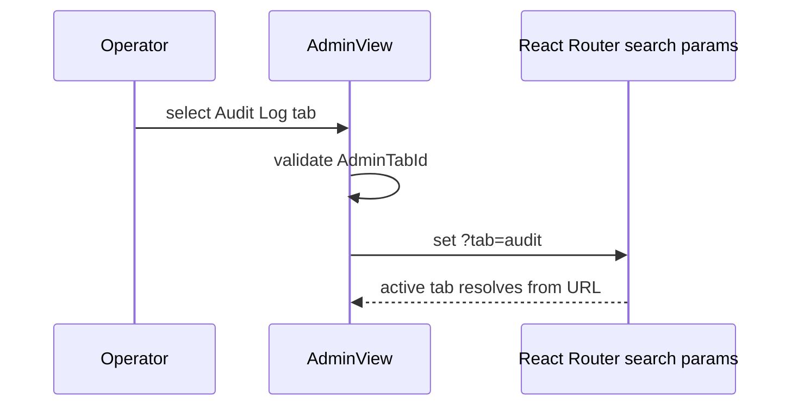
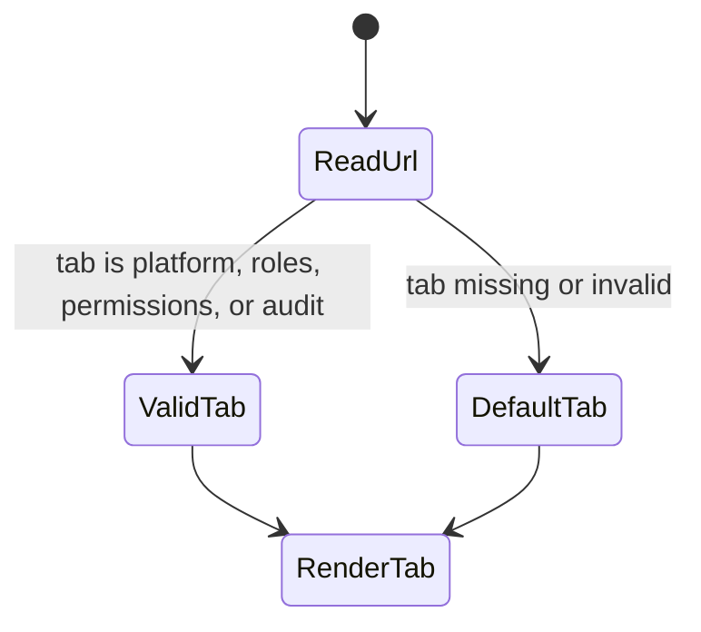

# Admin Route Position Component

## Purpose

This guide defines the local component semantics for preserving the operator's
position inside the Admin and RBAC route.

The component owns route-local tab position only. It does not own Admin data,
RBAC policy, platform health, role persistence, audit-log persistence, or
backend authorization.

## Public API

| API                          | Owner                             | Responsibility                                                      |
| ---------------------------- | --------------------------------- | ------------------------------------------------------------------- |
| `AdminView`                  | `AdminView.tsx`                   | Compose the Admin route and bind active tab to URL search state.    |
| `initialTab`                 | `AdminView.tsx`                   | Test/bootstrap fallback when the URL has no valid tab.              |
| `resolveActiveAdminTab(...)` | `AdminView.tsx`                   | Resolve a valid Admin tab from `URLSearchParams`.                   |
| `handleTabChange(...)`       | `AdminView.tsx`                   | Write the next valid tab to `?tab=...`.                             |
| `useAdminViewData()`         | `views/admin/useAdminViewData.ts` | Supply platform, capabilities, role and audit data to passive tabs. |

## Invariants

- The URL is the durable owner of Admin tab position.
- Refreshing `/admin?tab=audit` must reopen the Audit Log tab.
- Invalid tab values must fall back to the route default instead of crashing.
- Route position must not be stored in component-only `useState`.
- Admin route position must not bypass backend authorization or capability
  checks.
- Presentation tabs are passive consumers of `useAdminViewData()` outputs.

## Transitions

### Tab selection

### Browser refresh

## Consumers

Direct consumers:

- React Router route `/admin`
- `AdminView.test.tsx`
- Admin platform, roles, permissions and audit tab components

Indirect consumers:

- Platform operators who refresh while inspecting Admin state
- PR reviewers validating route-position semantics
- Local protected-runtime debugging where Admin is used to inspect backend
  readiness and capabilities

## Semantic Encapsulation

`AdminView.tsx` has one owned concern: render the Admin/RBAC route and keep its
tab position URL-addressable. It should not absorb RBAC policy, fetch mapping,
platform health parsing, or audit-log filtering beyond composition.

The component is intentionally not generalized into a shared route-tab helper.
That abstraction should be introduced only after another route has the same
route-position invariant and test coverage.

## Negative Coverage

Primary tests:

- `apps/web/src/app/views/AdminView.test.tsx`
- `apps/web/src/app/views/AdminView.architecture.test.ts`

The tests cover:

- tab selection writes `?tab=audit`;
- browser refresh hydrates from `/admin?tab=audit`;
- the route does not use component-only `useState` for tab position;
- the local component guide and Fowler analysis remain discoverable.

## Drift To Watch

- Do not move tab position into local React state.
- Do not let Admin tabs directly decode auth tokens or call protected endpoints
  outside service/component boundaries.
- Do not promise editable RBAC behavior until the backend route and capability
  contract are verified.
